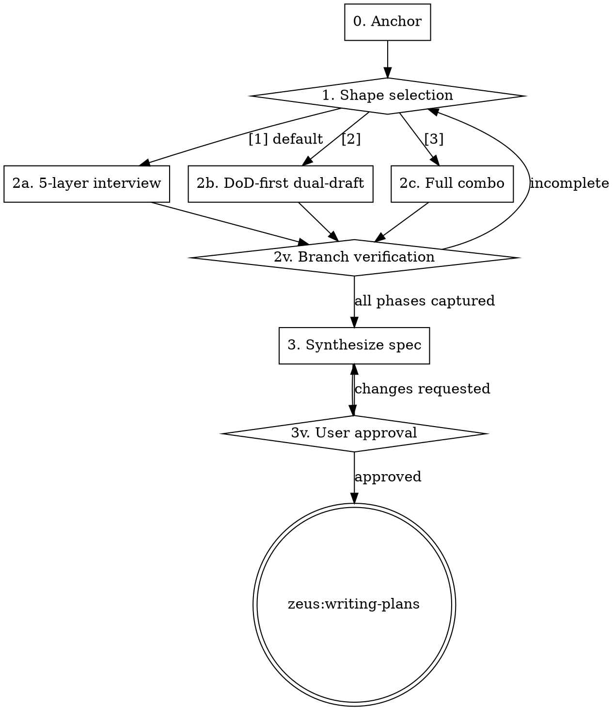

# Brainstorming

## Overview

Brainstorming is the first concrete skill any zeus-managed feature work runs. It anchors the design conversation in the project's binding contract (AGENTS.md), records the resulting spec in a fixed 6-section format that downstream skills consume, and offers the user three different brainstorming shapes — including a fast adversarial dual-draft mode for users who want to react to concrete proposals instead of answering questions in sequence. L01's argument: capable agents fail at execution because they invent context; brainstorming forces them to read the contract first.

## Iron Law

**NO IMPLEMENTATION SKILL RUNS UNTIL A BRAINSTORMING SPEC IS WRITTEN AND USER-APPROVED.**

**THE SPEC ALWAYS HAS THE SAME 6 SECTIONS, REGARDLESS OF WHICH BRAINSTORMING SHAPE WAS USED.**

If a downstream skill (writing-plans, executing-plans, etc.) is invoked without an approved spec for the work in progress, it must redirect here. The 6-section output format is the contract that decouples brainstorming from execution.

## Process flow

### Phase 0 — Anchor (always runs)

0. **Clear previous markers and activate brainstorming.** Run: `mkdir -p .zeus/state && rm -f .zeus/state/spec-approved && echo "active" > .zeus/state/brainstorming-active`
1. **Read `AGENTS.md`** at the project root. Note the DoD items, conventions, commands, invariants. If the file is missing, abort with: "No AGENTS.md found. Run `zeus:kickoff-agents-md` first to establish the project's binding contract."
2. **Read `FEATURES.md`** if present. Skip silently if absent.
3. **Show the user the current 7-gate cascade** so they know what "done" will mean for this work. Tell them: "Once we ship this design, completion will be gated by these seven evidence levels: G1 code → G2 TDD red-green → G3 verification command → G4 DoD satisfied → G5 E2E pipeline → G6 two-stage review → G7 handoff state."
4. **Confirm F-NNN target.** Ask: "Is this work for an existing feature in FEATURES.md, or a new one?" If new, propose a name and reserve the next F-NNN ID. Final FEATURES.md update happens in Phase 3.

### Phase 1 — Shape selection (always runs)

Ask the user, verbatim:

```
How should we approach this design?

  [1] Walk me through it
      I'll ask questions in order: what's in/out of scope,
      what existing patterns to follow, what runtime changes
      we need, how we'll verify it works, and what state to
      leave behind for the next session.
      Best when you want to think it through step by step.
      (Default — press Enter to pick this.)

  [2] Show me two options
      First tell me what "done" looks like as actual shell
      commands. Then I'll generate two different design
      approaches side by side and you pick one (or blend them).
      Best when you want concrete proposals to react to,
      instead of answering questions.

  [3] Both
      Two options first, you pick one, then we walk through
      every aspect of the chosen design together.
      Best for high-stakes features where the extra rigor pays
      off.
```

Wait for the user's choice. Default (Enter or no answer) selects [1].

### Phase 2 — Run chosen shape

#### Branch [1] α — 5-layer interview

Walk the user through the five defense layers in order. Each layer produces ≥ 1 structured note that becomes input to the spec's Phase 3.

- **L1. Task Spec** — What's IN scope? What's OUT? Who's the user/agent of the behavior? Capture corner cases.
- **L2. Context** — What existing patterns or utilities should this follow? What other systems does this touch? Surface adjacent code the agent has read.
- **L3. Environment** — Any new dependencies? CI changes? Runtime impact? Sandbox or version pins.
- **L4. Verification** — How will we know this is done? Smallest E2E test that proves it works? New AGENTS.md DoD items.
- **L5. State** — What state does this leave behind for the next session? Observability or handoff requirements.

#### Branch [2] β+γ — DoD-first dual-draft

- **P1. L4 first** — "What does done look like as actual shell commands?" Build a DoD delta.
- **P2. Dual-draft** — Generate two complete alternative designs side by side, both producing the agreed DoD. Display trade-offs:

```
Approach A: <name>
  Pros: <list>
  Cons: <list>
  Risk: <list>

Approach B: <name>
  Pros: <list>
  Cons: <list>
  Risk: <list>
```

Both must be complete (not stubs). If the agent cannot generate two genuinely different designs, the skill stops and reports: "Only one viable approach. Drop to branch [1] α."

- **P3. User pick** — Approach A, Approach B, blend, or reject both (re-draft).
- **P4. Backfill** — Around the chosen draft, fill in L1 (scope), L2 (context), L3 (environment), L5 (state) by direct question.

#### Branch [3] α+β+γ — Full combo

- **P1.** L4 DoD delta (β P1).
- **P2.** Dual-draft (β P2).
- **P3.** User pick.
- **P4.** L1 walk against the chosen draft.
- **P5.** L2 walk.
- **P6.** L3 walk.
- **P7.** L5 walk.

### Phase 2 verification (must pass before Phase 3)

| Branch  | Required output                                                                                                |
| ------- | -------------------------------------------------------------------------------------------------------------- |
| α       | Each of L1–L5 has ≥ 1 captured note. Empty layer = unfinished brainstorm.                                       |
| β+γ     | Two complete alternative designs were generated; user explicitly picked or blended; L1/L2/L3/L5 backfilled.    |
| α+β+γ   | Two complete alternative designs + L1/L2/L3/L5 walks each have ≥ 1 captured note.                              |

### Phase 3 — Synthesize (always runs)

1. **Write spec** to `docs/specs/<YYYY-MM-DD>-<topic>-design.md` with these six fixed sections, in this order:

```markdown
## Goal / Scope                          ← L1 output
## Architecture / Context dependencies   ← L2 output
## Environment requirements              ← L3 output
## Definition of Done delta              ← L4 output (will patch AGENTS.md DoD)
## Handoff state requirements            ← L5 output
## 7-gate impact map                     ← which gates get new constraints
```

2. **Update `FEATURES.md`**: F-NNN status → `in-progress`, `**Spec:**` field → relative link to the spec.
3. **Self-review**: placeholder scan, internal consistency, scope check, ambiguity. Fix inline.
4. **User reviews** the spec file. Wait for `approve` or change requests.
5. **On approval**: write the spec-approved marker and remove the active marker. Run: `echo "<spec-file-path>" > .zeus/state/spec-approved && rm -f .zeus/state/brainstorming-active`
6. **Hand off** to `zeus:writing-plans`.



## Anti-rationalization table

| Thought                                                                | Reality                                                                            |
| ---------------------------------------------------------------------- | ---------------------------------------------------------------------------------- |
| "I'll skip the Anchor phase, I know the project."                       | The user just told you the feature in plain English; AGENTS.md tells you the version pins, conventions, and DoD. Skipping either turns the spec into vibes. |
| "User picked branch [2], I'll skip layer 5 (handoff state)."            | Branch [2] backfills L1/L2/L3/L5 in P4. Skipping any layer = unfinished spec.        |
| "DoD delta is empty, the feature doesn't add new DoD items."            | Every meaningful change touches G4. If truly nothing's added, write `(none)` explicitly. Empty is a different signal from omitted. |
| "User said 'just make it work', I'll skip shape selection."             | "Just make it work" is a request to ship, not to skip thinking. Run branch [1] α; it's the safest default. |
| "Two drafts in branch [2] are essentially the same approach."           | Then there is only one viable approach. Drop to branch [1] α. Two stub-drafts don't satisfy the contract. |

## Red flags / Stop conditions

- AGENTS.md missing → abort, redirect to `zeus:kickoff-agents-md`.
- User refuses to read the 7-gate cascade and wants to skip Anchor — refuse politely; the cascade is the contract.
- Branch [2] cannot produce two genuinely different drafts after one attempt — drop to branch [1] α with a note explaining why.
- Spec self-review finds contradictions that the user cannot resolve in two iterations — surface to the user and pause; do not ship a contradictory spec.

## Verification checklist

- AGENTS.md was read in Phase 0 (chat note: "Read AGENTS.md, DoD has N items, conventions are …").
- F-NNN target chosen and reserved.
- Phase 1 prompt presented verbatim; a branch was picked.
- Phase 2 verification table satisfied for the chosen branch.
- Spec file exists at `docs/specs/<date>-<topic>-design.md` with all 6 fixed sections (`grep -c '^## ' <spec>` ≥ 6, and each canonical heading present via `grep -q '^## Goal / Scope$'` etc.).
- FEATURES.md F-NNN status updated and spec link present.
- User has explicitly approved before any handoff.

## Integration

- **Predecessor:** `zeus:kickoff-feature-list` (FEATURES.md should exist) or direct user invocation.
- **Successor:** `zeus:writing-plans` (after spec approval).
- **Gates addressed:** G4 — sets up DoD delta.
- **Defends layer:** 1 (task specification).
