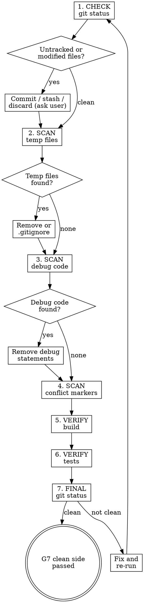

# Clean State

## Overview

L12 argued that every session must leave a clean state because leftover artifacts — temp files, debug prints, half-committed experiments — create archaeology costs for the next session. This skill is the cleanup side of G7. Its complement `session-handoff` writes what to remember; clean-state removes what to forget. Both must pass for G7 to close.

## Iron Law

**NO BRANCH SHIPS WITH DANGLING STATE. IF THE WORKING TREE IS NOT CLEAN, G7 STAYS CLOSED.**

## What "clean" means

A branch is clean when all of the following are true:

| Check | Command | Pass condition |
|-------|---------|----------------|
| Working tree clean | `git status` | No untracked files, no unstaged changes, no staged-but-uncommitted changes |
| No temp files | `find . -name '*.tmp' -o -name '*.bak' -o -name '*.swp' -o -name '*~' -o -name '.DS_Store'` | Zero results (excluding `.zeus/` and `node_modules/`) |
| No debug code | `grep -rn 'console\.log\|debugger\|print(\|pdb\.\|binding\.pry\|TODO.*REMOVE\|FIXME.*REMOVE\|HACK' src/ lib/ app/` | Zero results in production code (test files exempt) |
| No conflict markers | `grep -rn '<<<<<<\|>>>>>>\|=======' src/ lib/ app/` | Zero results |
| Branch builds | project-specific build command | Exit 0 |
| Tests pass | project-specific test command | Exit 0 |

The specific directories to scan (`src/`, `lib/`, `app/`) should be adapted to the project. Read `AGENTS.md` for the project's source layout.

## Process flow

1. **CHECK WORKING TREE** — Run `git status`. If untracked or modified files exist, decide: commit them, stash them, or discard them (with user confirmation for discard).

2. **SCAN FOR TEMP FILES** — Find temporary files that should not ship. Remove them or add to `.gitignore`.

3. **SCAN FOR DEBUG CODE** — Grep for debug statements in production code. Remove any that are not intentional (test helpers, logging frameworks are fine — `console.log("debugging X")` is not).

4. **SCAN FOR CONFLICT MARKERS** — Grep for merge conflict markers. These should never exist in a shippable branch.

5. **VERIFY BUILD** — Run the project's build command. If it fails, the branch is not shippable — fix before proceeding.

6. **VERIFY TESTS** — Run the project's test suite. If tests fail, the branch is not shippable — fix before proceeding.

7. **FINAL STATUS** — Run `git status` one more time. If clean, G7 clean side passes.

## Debug code exceptions

Not all debug-like patterns are problems. Use judgment:

| Pattern | Action |
|---------|--------|
| `console.log` in production code | Remove — use a logging framework instead |
| `console.log` in test files | Keep — test debugging is normal |
| `logger.debug(...)` | Keep — structured logging is intentional |
| `debugger` statement | Remove — always |
| `print()` in Python production code | Remove — use `logging` module |
| `print()` in Python test files | Keep |
| `// TODO: ...` | Keep if it describes future work. Remove if it says `TODO REMOVE` or `TODO HACK` |
| `binding.pry` / `byebug` | Remove — always |

## Handling unclean state

When `git status` shows unexpected files:

1. **Do not auto-delete.** Untracked files may be the user's in-progress work.
2. **Ask the user** what to do: commit, stash, or discard.
3. **If the user is not available** (autonomous mode), stash with a descriptive message: `git stash push -m "zeus clean-state: untracked files from session 2026-04-28"`.

When staged-but-uncommitted changes exist:
1. **Check if they belong to the current task.** If yes, commit them.
2. **If they are unrelated**, ask the user or stash.

## Anti-rationalization table

| Thought | Reality |
|---------|---------|
| "One debug log won't hurt." | Debug logs in production are noise. Remove it. |
| "The temp file is harmless." | Temp files confuse the next session. Remove or gitignore. |
| "Tests are passing, good enough." | Passing tests with a dirty working tree is not clean state. Both matter. |
| "I'll clean up later." | Later is the next session, which starts with zero context about your mess. Clean now. |
| "The untracked file is probably nothing." | Do not assume. Check what it is. Ask the user if unsure. |

## Red flags / Stop conditions

- About to declare G7 with untracked files → stop, resolve them first.
- `grep` finds debug statements and agent ignores them → stop, evaluate each one.
- Build or tests failing → stop, fix before claiming clean state.
- About to `git clean -f` or `git checkout .` without user confirmation → stop, these are destructive. Ask first.
- Conflict markers found → stop, this is a critical issue. Resolve before anything else.

## Verification checklist

- [ ] `git status` shows clean working tree.
- [ ] No temp files in project directories.
- [ ] No debug code in production files.
- [ ] No merge conflict markers anywhere.
- [ ] Build passes.
- [ ] Tests pass.
- [ ] Final `git status` confirms clean state.

## Integration

- **Complement:** `zeus:session-handoff` (handoff writes what to remember, clean-state removes what to forget). Both must pass for G7.
- **Predecessor:** all implementation and review work is complete.
- **Successor:** `zeus:finishing-a-development-branch` (SP7) — only runs after G7 closes.
- **Calls:** project-specific build and test commands from `AGENTS.md`.
- **Gates addressed:** G7 (clean side) — clean working tree is one of two requirements for G7 to close.
- **Defends layer:** 5 (state management).
