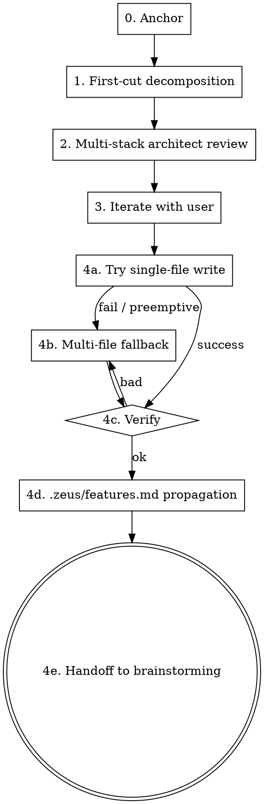

# Decompose Large Projects

## Overview

When a user describes something too big to fit in a single brainstorming spec, this skill produces a sub-project map — one entry per sub with stable IDs, dependency edges, primary defense layer, and gate impact. Each sub then runs its own brainstorm → spec → plan cycle independently. This is the productized version of the manual decomposition zeus itself went through (SP1–SP7). L07 + L08 argue: feature lists and sub-project boundaries are harness primitives; they prevent overreach and under-finish.

## Process flow

### Phase 0 — Anchor

1. Resolve the project contract per `references/project-contract.md` (CLAUDE.md → AGENTS.md). `cat` the selected file if present.
2. `cat .zeus/features.md` if present.
3. Have the user describe the big thing in one paragraph.

### Phase 1 — First-cut decomposition

Agent proposes an initial sub-project map. Each sub has:

- **ID:** `SP-A1`, `SP-A2`, … (or other prefix if user has a preference).
- **Name:** short noun phrase.
- **Purpose:** one-sentence "this exists to …".
- **Scope:** small / medium / large.
- **Layer:** primary defense layer (1–5).
- **Gates:** subset of G1–G7 this sub will set up or close.
- **Depends on:** list of prior sub-project IDs (or `—` for foundation).

### Phase 2 — Multi-stack architect review

Apply the same multi-stack architect lens as `zeus:writing-plans` Phase 1. Surface concerns:

- Is each sub independently testable (clean boundary)?
- Hidden dependencies ("these look independent but actually X must ship first because Y assumes its data model")?
- Is the order sensible (foundation before dependents)?
- Anything the user didn't mention but the project will need (auth? logging? deployment?)?

Write findings into the map's "Architect concerns" section.

### Phase 3 — Iterate with user

Show map + concerns to the user. User can: combine subs, split, reorder, remove, add. Iterate until the user is happy.

### Phase 4 — Lock (with multi-file fallback)

#### Phase 4a: Try single-file write

Target: `.zeus/specs/<YYYY-MM-DD>-<topic>-decomposition.md`. Single attempt.

#### Phase 4b: Fallback to multi-file

Triggers (any one):

- Phase 4a Write tool returns error (content too large / IO).
- Two consecutive write attempts fail.
- Edit retries on the file ≥ 2 fail.
- Pre-emptive: sub-project count > 10.
- Pre-emptive: estimated total length > 1500 lines.

On trigger, the agent says explicitly: "Single-file write failed (or pre-emptive trigger fired); falling back to multi-file split per Phase 4b." Never silent fallback.

New layout:

```
.zeus/specs/<YYYY-MM-DD>-<topic>-decomposition/
├── README.md          ← top-level: table + dep graph + execution order + architect concerns
├── SP-A1.md           ← one file per sub-project
├── SP-A2.md
└── ...
```

`README.md` links to each `SP-X.md`. Each `SP-X.md` contains: name / purpose / scope / layer / gates / depends-on / per-sub architect concerns / per-sub initial risk register.

#### Phase 4c: Verification (both modes)

- All content on disk (`grep` finds every SP description).
- Cross-file links resolve in multi-file mode.
- No single file exceeds 1500 lines.
- Dependency graph is a DAG (topological sort succeeds).
- At least one foundation sub (no `Depends on`) exists.

#### Phase 4d: .zeus/features.md propagation

If `.zeus/features.md` exists, propose adding each sub as an `F-NNN` entry (status `planned`, dependsOn edges as features). User confirms each.

#### Phase 4e: Handoff

Recommend the user start `zeus:brainstorming` on the first foundation sub-project. Each sub then runs its own brainstorm → spec → plan → execute cycle.



## Output format (single-file mode)

```markdown
# Decomposition: <project name>

## Sub-project map

| ID    | Name              | Scope  | Layer | Gates       | Depends on |
| ----- | ----------------- | ------ | ----- | ----------- | ---------- |
| SP-A1 | …                 | medium | 2, 4  | G4, G6      | —          |
| SP-A2 | …                 | small  | 1     | G4, G5      | SP-A1      |

## Architecture rationale

<2–3 sentences: why this cut, alternatives considered>

## Dependency graph

\`\`\`dot
digraph deps { … }
\`\`\`

## Recommended execution order

1. SP-A1 (no deps)
2. …

## Architect concerns surfaced

- <concern 1>
- <concern 2>
```

## Output format (multi-file mode SP-X.md)

```markdown
# SP-X: <name>

**Purpose:** <one sentence>
**Scope:** small | medium | large
**Defense layer:** 1–5
**Gates impacted:** G…
**Depends on:** SP-Y, SP-Z (or —)

## Architect concerns specific to this sub

- <concern>

## Initial risk register

- <risk> — <mitigation>
```

## Anti-rationalization table

| Thought                                                  | Reality                                                                            |
| -------------------------------------------------------- | ---------------------------------------------------------------------------------- |
| "I can fit all of this in a single brainstorm."           | A spec with > 10 independent decisions becomes internally inconsistent. Decompose first. |
| "These subs aren't really independent."                   | Then they're not subs. Either combine, or expose the hidden dependency explicitly. |
| "Order doesn't matter, do whichever is easiest."          | Foundation first. Anything everything depends on IS the foundation.                 |
| "I'll build first then split into subs after."            | That's drawing the blueprint after pouring concrete. Decompose first.              |
| "Single-file is fine, I don't need fallback."             | Until the file is 2000 lines and Edit keeps failing. Multi-file is cheaper than the failed-edit retry loop. |

## Red flags / Stop conditions

- < 2 sub-projects produced — decomposition wasn't needed; route back to `zeus:brainstorming` directly.
- Dependency graph has a cycle — surface to user; refuse to lock until acyclic.
- User wants to assign their own SP-IDs out of sequence — refuse, IDs are agent-managed for stability.

## Verification checklist

- Output file(s) exist.
- ≥ 2 sub-projects.
- Each sub has all 7 fields (ID / Name / Purpose / Scope / Layer / Gates / Depends on).
- Dependency graph is a DAG (topological sort succeeds in `awk` or by hand).
- At least one foundation sub (no `Depends on`).
- In multi-file mode: `README.md` has working links to every `SP-X.md`.

## Integration

- **Predecessor:** `zeus:brainstorming` (when its scope check fails) or direct user invocation.
- **Successor:** `zeus:brainstorming` (for the first foundation sub).
- **Defends layer:** 1 (task specification — boundary definition is itself spec work).
