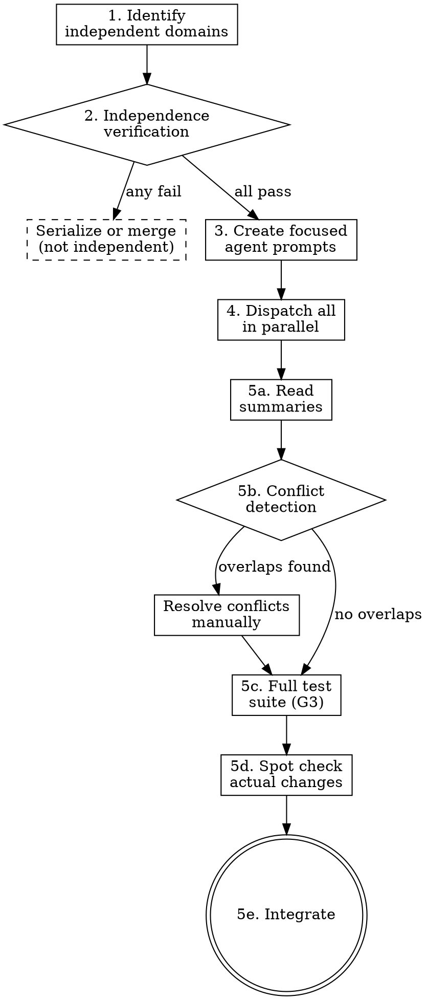

# Dispatching Parallel Agents

## Overview

L07's argument: agents overreach and under-finish — they try to hold too many problems in context at once and solve none of them well. Dispatching parallel agents addresses this by giving each agent a narrow, self-contained scope. When you have multiple independent problems (different test files failing, different subsystems broken, different features to build), investigating them sequentially wastes time. Each investigation is independent and can happen concurrently — one agent per problem domain.

## Process flow

1. **Identify independent domains.** Group failures or tasks by what's broken or what's needed. Each domain should be a self-contained problem that can be understood and solved without context from the others.

2. **Independence verification checklist.** Before dispatching, confirm all four:
   - No shared files between domains? (agents editing the same file = conflicts)
   - No shared state or resources? (database tables, config files, environment variables)
   - Fix in domain A cannot affect domain B? (no hidden coupling)
   - Each domain is self-contained? (agent can understand and solve it with provided context alone)

   If any check fails, do not parallelize those domains. Either serialize them or merge them into one agent's scope.

3. **Create focused agent prompts.** Each agent gets:
   - **Specific scope:** one test file, one subsystem, one feature — not "fix everything."
   - **Clear goal:** "make these tests pass" or "implement this feature" — concrete and verifiable.
   - **Constraints:** "don't change code outside this directory" or "don't modify the API contract."
   - **Context:** error messages, test names, relevant code excerpts — everything the agent needs without reading the whole codebase.
   - **Expected output:** "return a summary of root cause and changes" — specific format.

4. **Dispatch all agents in parallel.** Use the platform's parallel dispatch mechanism (Claude Code Agent tool with multiple calls, Codex parallel tasks, etc.).

5. **Integration — when agents return:**
   a. **Read each summary.** Understand what each agent found and changed.
   b. **Conflict detection.** Check for overlapping file edits across agents. If two agents edited the same file, resolve manually before proceeding.
   c. **Run full test suite (G3).** Fresh verification of the entire codebase — not just each agent's scope. Use the project's real test runner from AGENTS.md Commands.
   d. **Spot check.** Agents can make systematic errors. Review the actual changes, not just the summaries.
   e. **Integrate.** If all checks pass, the parallel work is complete.



## Agent prompt structure

Good agent prompts are focused, self-contained, and specific about output.

### Example: fixing independent test failures

```markdown
Fix the 3 failing tests in src/agents/agent-tool-abort.test.ts:

1. "should abort tool with partial output capture" — expects 'interrupted at' in message
2. "should handle mixed completed and aborted tools" — fast tool aborted instead of completed
3. "should properly track pendingToolCount" — expects 3 results but gets 0

These are timing/race condition issues. Your task:

1. Read the test file and understand what eacht verifies
2. Identify root cause — timing issues or actual bugs?
3. Fix by:
   - Replacing arbitrary timeouts with event-based waiting
   - Fixing bugs in abort implementation if found
   - Adjusting test expectations if testing changed behavior
4. Use the project's real test runner (vitest --run) to verify — not a custom script

Do NOT just increase timeouts — find the real issue.
Constraint: do NOT change files outside src/agents/

Return: Summary of root cause, what you fixed, and test results.
```

### Common mistakes

| Bad | Good | Why |
|-----|------|-----|
| "Fix all the tests" | "Fix agent-tool-abort.test.ts" | Narrow scope prevents overreach |
| "Fix the race condition" (no context) | Paste error messages and test names | Agent needs specifics to start |
| No constraints | "Do NOT change production code" | Prevents scope creep |
| "Fix it" (vague output) | "Return summary of root cause and changes" | You need to know what changed |

## Anti-rationalization table

| Thought | Reality |
|---------|---------|
| "These failures might be related, but I'll parallelize anyway." | Related failures should be investigated together first. Fix one, see if others resolve. |
| "I'll skip the independence check, it's obvious they're independent." | "Obvious" independence is how you get two agents editing the same file. Check every time. |
| "Full test suite after integration is overkill." | Individual agent fixes can interact in unexpected ways. The full suite is the only proof they compose correctly. |
| "Agent summaries are enough, I don't need to spot-check." | Agents can make systematic errors. Read the actual diffs. |
| "I'll dispatch 10 agents for 10 problems." | More agents = more integration complexity. Group related problems. 3-5 parallel agents is a practical 

## Red flags / Stop conditions

- Independence check fails for any pair of domains → do not parallelize those domains.
- Two agents return edits to the same file → resolve manually before running tests.
- Full test suite fails after integration → investigate which agent's changes broke things. Do not blindly retry.
- Agent summary doesn't match actual changes → investigate the discrepancy before integrating.
- More than 5 parallel agents dispatched → reconsider grouping. Diminishing returns and integration complexity increase.

## Verification checklist

- [ ] Independence verification checklist passed for all domain pairs.
- [ ] Each agent prompt has: specific scope, clear goal, constraints, context, expected output format.
- [ ] All agents dispatched in parallel (not sequentially).
- [ ] All agent summaries read and understood.
- [ ] Conflict detection performed (no overlapping file edits, or conflicts resolved).
- [ ] Full test suite run fresh after integration (G3) using ecosystem-standard test runner.
- [ ] Actual changes spot-checked against agent summaries.

## Integration

- **Called by:** `zeus:executing-plans` or `zeus:subagent-driven-development` when multiple independent problems arise during execution.
- **Also useful for:** independent debugging investigations, parallel feature implementation on non-overlapping subsystems.
- **Gates addressed:** G3 (fresh verification after integration).
- **Defends layer:** 3 (execution environment).
