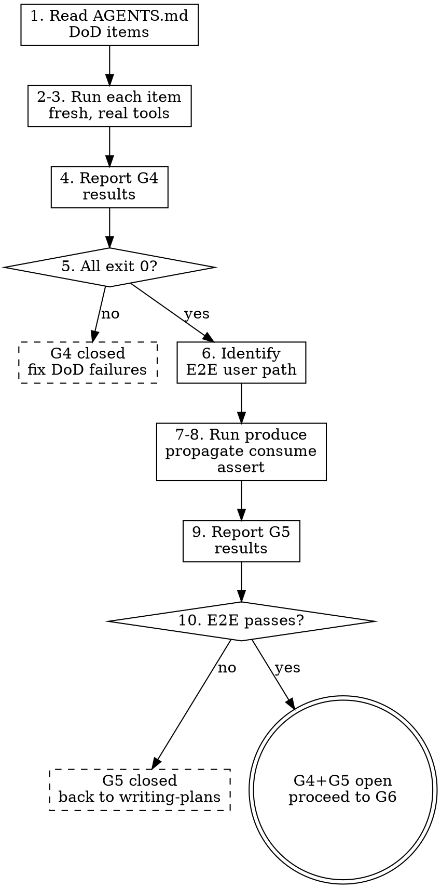

# E2E Gate

## Overview

L09's argument: agents declare victory when unit tests pass, but unit tests don't prove the integrated system works. L10's argument: end-to-end testing changes results — until the whole pipeline runs, unit-level passes mean nothing in the integrated context. The e2e-gate enforces both: first, every command-verifiable DoD item must exit 0 (G4); then, a realistic user path must run from start to finish — produce, propagate, consume, assert (G5). Unit tests passing is necessary but not sufficient.

## Iron Law

**NO WORK SHIPS UNTIL EVERY DOD ITEM EXITS 0 AND THE E2E PATH RUNS START TO FINISH.**

G4 and G5 are sequential. G4 must pass before G5 runs. If G4 fails, there is no point running E2E — fix the DoD failures first.

## Process flow

### Phase 1 — G4: DoD sweep

1. **Read AGENTS.md** `## Definition of Done`. Extract every command-verifiable item.
2. **Run each item** as a fresh command. Capture full stdout and exit code. Use `zeus:verification-before-completion` discipline — no paraphrasing, no "should pass."
3. **Use ecosystem-standard tools.** If a DoD item says "lint passes," run the real linter (ESLint, Ruff, cargo clippy), not a custom grep.
4. **Report results.** Table format: item | command | exit code | pass/fail.
5. **All must exit 0.** Any non-zero → G4 stays closed. Report which items failed and stop.

### Phase 2 — G5: E2E pipeline

6. **Identify the realistic user path.** Read the plan's Test Plan section (E2E tests subsection). If no E2E test is defined, construct one: what would a real user do from start to finish?
7. **The path must be produce → propagate → consume → assert:**
   - **Produce:** create the artifact the feature generates (data, file, API response, UI state).
   - **Propagate:** move it through the system (database write, message queue, API call, state update).
   - **Consume:** read it back from the consumer's perspective (query, render, fetch).
   - **Assert:** verify the consumed result matches expectations.
8. **Run the E2E path.** Capture full output. This is not a unit test — it touches the same surfaces a real user would.
9. **Report results.** What ran, what passed, what failed, with evidence.
10. **E2E must pass.** If it fails → G5 stays closed. The failure is usually a contract mismatch between tasks, not a bug at the task level. Route back to `zeus:writing-plans`.

## Failure routing

| Gate | Failure means | Route to |
|------|--------------|----------|
| G4 | A DoD item doesn't exit 0 | Back to `zeus:executing-plans` — re-run the failing task. After 3 failures, escalate to `zeus:brainstorming`. |
| G5 | E2E path fails | Back to `zeus:writing-plans` — the failure is usually a contract mismatch between tasks, not a task-level bug. The plan needs revision. |

## Ecosystem-standard tooling mandate

DoD items and E2E tests must use the ecosystem's real tools:

- If DoD says "tests pass" → run `pytest` / `vitest --run` / `cargo test`, not a custom script.
- If DoD says "lint clean" → run `eslint` / `ruff` / `cargo clippy`, not `grep`.
- If DoD says "type check passes" → run `mypy --strict` / `tsc --noEmit`, not "no red squiggles."
- If E2E involves an API → use `curl` / `httpie` / the project's real client, not a mock.

## Anti-rationalization table

| Thought |
|---------|---------|
| "Unit tests pass, that's enough." | Unit tests don't prove the integrated system works. L10's entire argument. |
| "DoD is just a formality." | DoD is the binding contract. Every item must exit 0. No exceptions. |
| "E2E is overkill for this small change." | Small changes break integration paths. The E2E is cheap insurance. |
| "I'll skip G4 and go straight to E2E." | G4 must pass before G5. Sequential, not optional. |
| "E2E failed but it's a flaky test." | Investigate the flakiness. Don't dismiss. Flaky E2E often reveals real integration issues. |
| "I'll write a quick smoke test instead of real E2E." | Smoke tests don't touch the same surfaces a real user would. Run the real path. |
| "DoD item is outdated, I'll skip it." | If it's outdated, update AGENTS.md first. Don't skip — fix the contract. |

## Red flags / Stop conditions

- Any DoD item exits non-zero → G4 closed. Do not proceed to G5.
- E2E path not defined in plan and agent cannot construct one → ask user for the realistic user path.
- Agent substitutes a mock or stub for a real system component in E2E → stop, use the real component.
- Agent claims "E2E passed" without running produce→propagate→consume→assert → stop, run the full path.
- G5 fails and agent tries to fix at the task level → stop, route to writing-plans. G5 failures are contract mismatches.

## Verification checklist

- [ ] AGENTS.md DoD read; all command-verifiable items extracted.
- [ ] Every DoD item run fresh with full stdout captured.
- [ ] All DoD items exit 0 (G4 open).
- [ ] Realistic E2E user path identified (from plan or constructed).
- [ ] E2E path follows produce→propagate→consume→assert.
- [ ] E2E run with full output captured.
- [ ] E2E passes (G5 open).
- [ ] All verification used ecosystem-standard tools.

## Integration

- **Predecessor:** `zeus:executing-plans` or `zeus:subagent-driven-development` (all tasks complete).
- **Successor:** `zeus:requesting-code-review` (G6).
- **Calls:** `zeus:verification-before-completion` (G3 discipline for each DoD item).
- **Failure routes:** G4 → `zeus:executing-plans`; G5 → `zeus:writing-plans`.
- **Gates addressed:** G4 (DoD fully satisfied), G5 (E2E pipeline passes).
- **Defends layer:** 4 (verification feedback).
