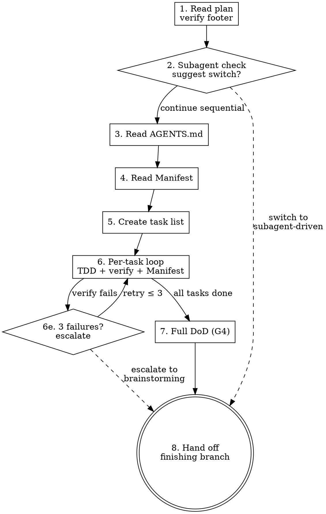

# Executing Plans

## Overview

L07's argument: agents overreach and under-finish — they start too many things and close none of them properly. L09's argument: agents declare victory based on internal reasoning rather than running the actual check. Executing-plans addresses both by forcing the agent to follow a pre-approved plan task by task, running each verification command fresh, and escalating after repeated failures instead of guessing. The plan is the contract; the agent executes it, not rewrites it.

## Phase banner (print first)

Before any other action in this skill, your **first user-facing output** MUST be the phase banner below, matched to the user's conversation language. Use ZH verbatim for Chinese, EN verbatim for English; for any other language, translate the EN template preserving the structure (header line, Goal, Frozen, Output). Print it as a fenced code block so the separators render cleanly.

**EN:**
```
━━━ Phase 3/3 · Execution ━━━
Goal: walk plan task by task — write code, run tests, capture evidence
Frozen: architecture decisions — if plan is wrong, return to Phase 2; do not improvise
Output: passing tests + DoD exit 0 → handoff
```

**ZH:**
```
━━━ 阶段 3/3 · 执行 ━━━
目标:按 plan 逐 task 落地 — 写代码、跑测试、留证据
已冻结:架构决策 — 若发现 plan 有误,回阶段 2 修改,不就地改架构
产出:测试全过 + DoD exit 0 → 进入交接
```

## Iron Law

**NO TASK EXECUTES WITHOUT A USER-APPROVED PLAN.**

**NO VERIFICATION IS PARAPHRASED — ACTUAL COMMAND OUTPUT IN CONTEXT.**

The plan must contain the footer signature `**User-approved:** <timestamp> by <user>` appended by `zeus:writing-plans`. Without it, refuse to run. Do not accept verbal approval as a substitute — the footer is the gate.

## Process flow

1. **Read plan file.** Verify the `**User-approved:**` footer exists. If missing, refuse: "This plan has no approval signature. Run `zeus:writing-plans` Phase 4 to get user approval first." Then verify the plan references a brainstorming spec (Section 1 or header). If the spec file is missing or incomplete (lacks all 6 sections), refuse: "Plan references spec at `<path>`, but spec is missing or incomplete. Run `zeus:brainstorming` first."
2. **Check subagent availability.** If the platform supports subagents (Claude Code Agent tool, Codex subagent, etc.), suggest: "Subagents are available. Consider `zeus:subagent-driven-development` for higher quality (two-stage review per task). Continue with sequential execution? [y/n]" Proceed only after the user confirms.
3. **Read AGENTS.md.** Extract Definition of Done items, Commands, Conventions (including file-size thresholds), and Invariants.
4. **Read Logic Completeness Manifest** (plan Section 9). Note any authorized simplifications. Everything else must be implemented in full.
5. **Create task list** from plan Section 4 (Tasks). One task per plan task, in order.
6. **Per-task execution loop:**
   a. Mark task in_progress.
   b. Follow TDD steps exactly — invoke `zeus:test-driven-development` discipline for each code change. Produce G2 evidence (FAIL then PASS).
   c. Run the task's verification command fresh. Capture full stdout in context (G3). Use the project's real ecosystem tools — never substitute a custom script.
   d. Check: did this task introduce unauthorized simplificate against the Manifest. Any TODO / stub / mock-as-final not logged in the Manifest is a violation — fix before proceeding.
   e. If verification fails: retry up to 3 times with different approaches. After 3 failures, escalate to `zeus:brainstorming` to question the architecture. Do not force through.
   f. Mark task completed.
7. **Full DoD run (G4).** After all tasks complete, run every command-verifiable item in AGENTS.md `## Definition of Done`. Capture each exit code. All must exit 0.
8. **Hand off** to `zeus:finishing-a-development-branch` (SP7). Until SP7 lands, present merge options inline: merge locally / push PR / keep branch / discard.



## Ecosystem-standard tooling mandate

Verification commands must use the ecosystem's established best-practice tools — never roll a custom scripthen a standard tool exists.

When the plan specifies a verification command, run it as-is. When the agent needs to verify something the plan didn't explicitly cover, use the ecosystem's standard tool for that stack:

| Stack | Lint | Test | Security |
|-------|------|------|----------|
| JS / TS | ESLint | Jest / Vitest | npm audit |
| Python | Ruff / Pylint | pytest | Bandit, pip-audit |
| Rust | cargo clippy | cargo test | cargo audit |
| Go | golangci-lint | go test | govulncheck |

If tempted to write a quick grep or shell one-liner instead of running the real tool — stop. The cm check is always weaker than the tool the ecosystem has battle-tested.

## Anti-rationalization table

| Thought | Reality |
|---------|---------|
| "Plan is too detailed, I'll summarize the steps." | The plan was approved at that granularity. Execute it at that granularity. |
| "This task is trivial, I'll skip TDD." | Trivial tasks break too. TDD takes 30 seconds for trivial code. |
| "Verification passed in my head, no need to run it." | G3 requires actual command output. Internal reasoning is not evidence. |
| "I'll fix this TODO later." | If it's not in the Manifest as an authorized simplification, it's a violation. Fix now. failures means the test is wrong." | Maybe. But the escalation path is brainstorming, not deleting the test. |
| "I'll write a quick shell check instead of running the real linter." | Custom checks are always weaker than battle-tested ecosystem tools. Use the real tool. |
| "Plan is outdated, I'll adapt on the fly." | Plans are contracts. If the plan is wrong, go back to writing-plans. Don't rewrite mid-execution. |
| "I'll skip the Manifest check, I didn't simplify anything." | The check is cheap. Skipping it is how unauthorized simplification ships unnoticed. |

## Red flags / Stop conditions

- Plan has no `**User-approved:**` footer → refuse to execute.
- Plan references no brainstorming spec, or spec file is missing → refuse to execute, redirect to `zeus:brainstorming`.
- Plan references files or APIs that don't exist → stop, report to user.
- Verification command fails 3 times → escalate to `zeus:brainstorming`.
- Agent discovers unauthorized simplification (TODO / stub / mock-as-final not in Manifest) → fix before proceeding.
- Agent is tempted to rewrite the plan mid-execution → stop. Go back to `zeus:writing-plans`.
- Agent substitutes a custom script for an ecosystem-standard tool → stop, use the real tool.
- DoD run (step 7) has any non-zero exit → do not hand off. Debug or escalate.

## Verification checklist

- [ ] Plan footer signaturerified before first task.
- [ ] AGENTS.md read; DoD items extracted.
- [ ] Logic Completeness Manifest read; authorized simplifications noted.
- [ ] Every task followed TDD (G2 evidence: FAIL then PASS in context).
- [ ] Every task's verification command run fresh with full stdout captured (G3).
- [ ] No unauthorized simplification introduced (Manifest check per task).
- [ ] All DoD items exit 0 (G4).
- [ ] All verification used ecosystem-standard tools, not custom scripts.
- [ ] Hand off to finishing-a-development-branch (or inline merge options).

## Integration

- **Predecessor:** `zeus:writing-plans` (plan must exist with approval footer).
- **Successor:** `zeus:finishing-a-development-branch` (SP7 forward ref).
- **Calls:** `zeus:test-driven-development` per task.
- **Escalates to:** `zeus:brainstorming` after 3 verification failures.
- **Alternative:** `zeus:subagent-driven-development` (suggested when subagents available).
- **References:** `references/karpathy-principles.md` — Simplicity First and Surgical Changes constrain per-task code changes.
- **Gates addressed:** G3 (fresh verification per task), G4 (full DoD run).
- **Defends layer:** 3 (execution environment).
