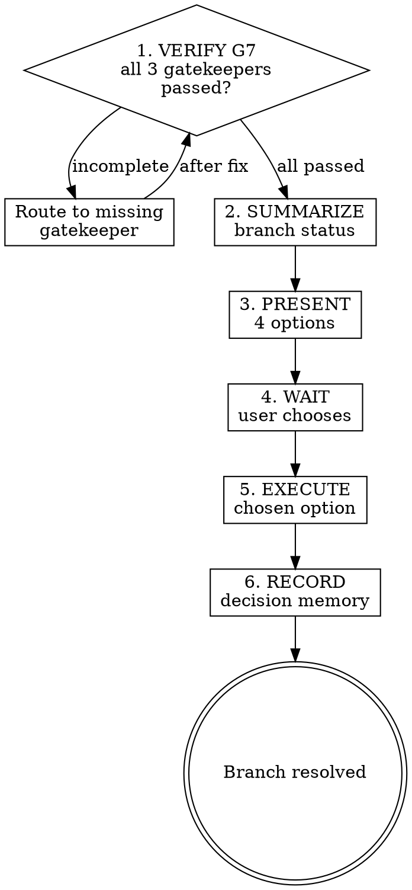

# Finishing a Development Branch

## Overview

This skill is the terminal state of the 7-gate completion cascade. L12's argument applies: the session must leave a clean state, and part of that is resolving the branch's fate. The agent presents options; the user decides. The agent never auto-merges to a default branch — that decision belongs to the human.

## Precondition

This skill only runs after G7 closes. G7 requires all three of:
- `session-handoff` — handoff memo written.
- `clean-state` — working tree clean, no dangling state.
- `observability` — run log written.

If any of these are missing, do not enter this skill. Go back and complete the missing G7 requirement.

## Process flow

1. **VERIFY G7** — Confirm that session-handoff, clean-state, and observability have all passed. If not, stop and route back to the missing gatekeeper.

2. **SUMMARIZE** — Present a brief summary of the branch: how many commits ahead of the target branch, which files changed, which features were implemented.

3. **PRESENT OPTIONS** — Offer exactly four choices:

   | Option | Command | When to use |
   |--------|---------|-------------|
   | 1. Merge locally | `git checkout <target> && git merge <branch>` | Work is complete, user wants it on the target branch now |
   | 2. Push and open PR | `git push -u origin <branch> && gh pr create` | Work needs remote review or CI before merge |
   | 3. Keep branch | (no action) | Work is paused, will resume later |
   | 4. Discard | `git checkout <target> && git branch -D <branch>` | Work is abandoned (confirm twice before executing) |

4. **WAIT FOR USER** — Do not proceed until the user explicitly chooses an option. Do not suggest a default. Do not auto-select.

5. **EXECUTE** — Run the chosen option's commands.
   - Option 1: merge and confirm with `git log --oneline -1`.
   - Option 2: push, create PR with a descriptive title and body (use handoff memo's "What Changed" as PR body), and return the PR URL.
   - Option 3: inform the user the branch is preserved and how to return to it.
   - Option 4: confirm twice ("This will delete the branch and all uncommitted work. Proceed?"), then execute.

6. **RECORD DECISION** — Write a `decision` memory to `.zeus/memory/decisions/` recording which option was chosen and why (if the user explained).

## Option 4 safety

Discarding a branch is destructive and irreversible. Before executing:

1. **First confirmation:** "This will delete branch `<name>` with N commits. Are you sure?"
2. **Second confirmation:** "Final check — all work on this branch will be lost. Type 'discard' to confirm."

If the user hesitates or says anything other than clear confirmation, do not proceed. Suggest option 3 (keep branch) instead.

## PR creation guidelines

When the user chooses option 2 (push and open PR):

- **Title:** concise summary of what the branch implements (e.g., "feat(SP7): add observability and branch finishing skills").
- **Body:** use the handoff memo's "What Changed" section as the starting point. Add a checklist of features/tasks completed.
- **Labels:** add relevant labels if the project uses them.
- **Draft:** ask the user if they want a draft PR or a ready-for-review PR.

## Anti-rationalization table

| Thought | Reality |
|---------|---------|
| "I'll just merge, the user probably wants that." | Never assume. Present options and wait. |
| "Option 1 is obviously correct here." | The user may want CI to run first (option 2) or may want to pause (option 3). Present all
| "G7 is close enough, I'll skip verification." | G7 is binary — passed or not. Verify before entering this skill. |
| "The user said 'ship it' so I'll auto-merge." | 'Ship it' means walk the cascade. It does not mean skip to merge. |

## Red flags / Stop conditions

- About to merge without user confirmation → stop, present options first.
- G7 not fully closed → stop, route back to missing gatekeeper.
- About to discard without double confirmation → stop, confirm twice.
- About to force-push → stop, never force-push from this skill. If force-push is needed, the user must do it manually.

## Verification checklist

- [ ] G7 confirmed closed (handoff + clean-state + observability all passed).
- [ ] Branch summary presented to user.
- [ ] All four options presented.
- [ ] User explicitly chose an option.
- [ ] Chosen option executed correctly.
- [ ] Decision recorded in `.zeus/memory/decisions/Integration

- **Predecessor:** G7 closure (`zeus:session-handoff` + `zeus:clean-state` + `zeus:observability`).
- **Called by:** `zeus:executing-plans` (end of plan execution), `zeus:subagent-driven-development` (end of subagent workflow).
- **Calls:** `zeus:memory-management` for decision recording.
- **Successor:** none — this is the terminal state.
- **Gates addressed:** none — this skill runs after all gates are closed.
- **Defends layer:** 5 (state management — ensures branch fate is resolved, not left dangling).
