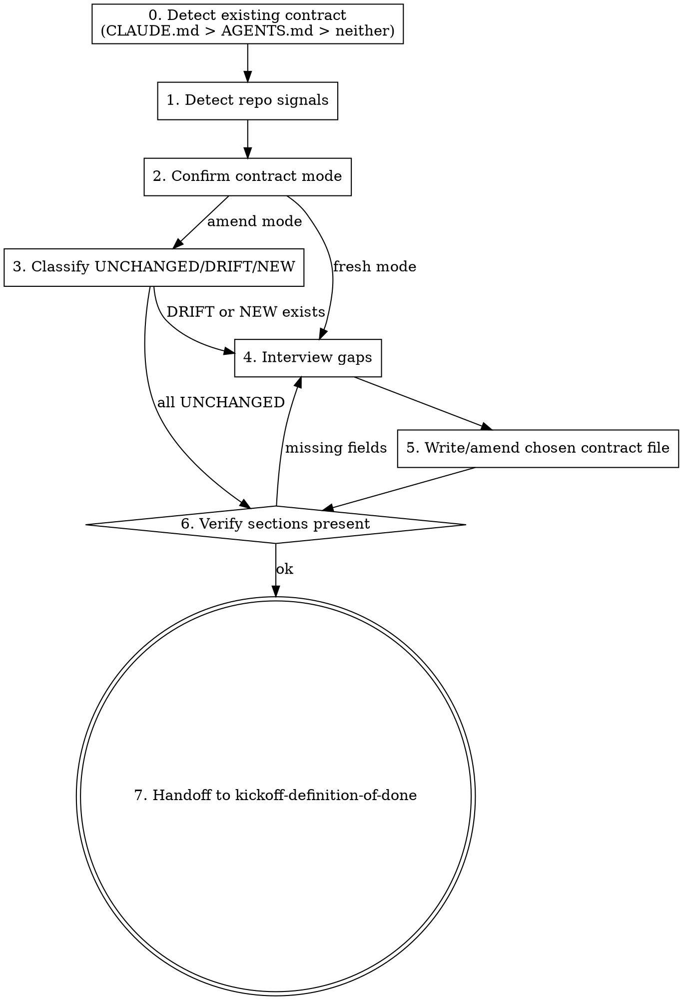

# Kickoff: AGENTS.md

## Overview

The project contract — `CLAUDE.md` (Claude Code convention) or `AGENTS.md` (zeus-native) — is the binding source of truth for agent work. It tells every future session the tech stack, conventions, commands, Definition of Done, and Invariants. Without it, the agent invents conventions on the fly (Layer 2 failure: context supply missing). This skill resolves which file is canonical via the precedence chain in `references/project-contract.md`, then generates or amends that file by reading the repo first (per L03's "system of record" argument) and only asking the user about fields that cannot be inferred from artifacts. The skill is file-name-neutral after step 0 selects the target.

## Iron Law

**NO PROJECT WORK PROCEEDS PAST PLANNING WITHOUT A POPULATED PROJECT CONTRACT.**

The contract is either `CLAUDE.md` (Claude Code convention) or `AGENTS.md` (zeus-native). The precedence chain in `references/project-contract.md` selects which file is canonical. If a downstream skill (writing-plans, executing-plans, kickoff-definition-of-done, kickoff-feature-list) detects no contract, it must redirect here. The skill never assumes "good defaults" for the user's project.

## Process flow

0. **Detect existing contract.** Run the precedence-chain protocol from `references/project-contract.md`. This step selects the target contract file BEFORE any detection or interview work runs. Three branches:
   - **`CLAUDE.md` exists** → switch to **CLAUDE.md-aware mode**. Do NOT generate `AGENTS.md`. Use `CLAUDE.md` as the contract for the rest of this flow. The interview only fills gaps — and the user picks the destination for those gaps: either (a) extend `CLAUDE.md` in-place (opt-in), or (b) default — write a separate `.zeus/dod.md` and leave `CLAUDE.md` terse. Also write a one-line lesson via `memory-management` to `.zeus/memory/lessons/` recording "project chose CLAUDE.md as its contract" so future sessions skip this prompt.
   - **Only `AGENTS.md` exists** → switch to amend mode against `AGENTS.md` (existing behavior; pick up at step 3).
   - **Neither exists** → ask the user: "Create CLAUDE.md (recommended — Claude Code compatibility) or AGENTS.md (zeus-native)?" Default: `CLAUDE.md`. The answer selects which template (`templates/CLAUDE.md.tmpl` or `templates/AGENTS.md.tmpl`) the rest of the flow uses. Record the choice as a lesson.
   - After this step, every downstream step refers to "the chosen contract file" — the skill is file-name-neutral from here on.
1. **Detect repo signals.** Scan the project root for the manifest files in the table below. Each found file contributes inferred values for one or more contract sections.
2. **Confirm contract mode.** Re-state the contract file selected in step 0 (e.g., "Writing to CLAUDE.md (CLAUDE.md-aware mode); DoD will land in .zeus/dod.md.") so the user can correct before interviewing.
3. **Classify (amend mode only).** For each field, classify as UNCHANGED / DRIFT / NEW against the chosen contract file. Show the user the counts before interviewing.
4. **Interview gaps.** Ask the user, one question at a time, only about fields that detection cannot resolve OR that detection contradicts the existing contract (DRIFT). Use multiple-choice when possible.
5. **Write the chosen contract file.** Use `templates/CLAUDE.md.tmpl` when the chosen contract is `CLAUDE.md`, or `templates/AGENTS.md.tmpl` when it is `AGENTS.md`. Substitute detected + interviewed values into the 5 sections. In CLAUDE.md-aware mode with the `.zeus/dod.md` destination, write the DoD checkboxes there and leave `CLAUDE.md`'s `## Definition of Done` section pointing to the external file.
6. **Verify.** Run the commands in the Verification checklist against the chosen contract file. Repeat phase 4 if any verification fails.
7. **Handoff.** Tell the user: "Contract ready at <chosen file>. Run `zeus:kickoff-definition-of-done` next to refine the DoD section into command-verifiable items."

## Detection signal table

| Signal file                                                                              | Yields (which AGENTS.md fields)                                          |
| ---------------------------------------------------------------------------------------- | ------------------------------------------------------------------------ |
| `package.json` `engines.node`, `dependencies`, `devDependencies`                          | Tech Stack: Node version, primary frameworks                              |
| `package.json` `scripts.{install,build,test,lint,typecheck,start,dev}`                    | Commands; DoD bootstrap candidates (test, lint, typecheck)                |
| `pyproject.toml`, `setup.py`, `requirements*.txt`, `Pipfile`                              | Tech Stack: Python; tool configs (pytest, mypy, ruff) drive Commands       |
| `Cargo.toml`                                                                              | Tech Stack: Rust; `cargo build/test/clippy` Commands                      |
| `go.mod`                                                                                  | Tech Stack: Go + minimum version                                          |
| `Gemfile`                                                                                 | Tech Stack: Ruby                                                          |
| `composer.json`                                                                           | Tech Stack: PHP                                                            |
| `pom.xml`, `build.gradle`                                                                 | Tech Stack: Java + build tool                                              |
| `Dockerfile`, `docker-compose.yml`                                                        | Tech Stack: containerized; runtime baseline                                |
| `.github/workflows/*.yml`                                                                 | Commands (CI source of truth); DoD candidates                              |
| `.tool-versions`, `.nvmrc`, `.python-version`, `.ruby-version`                            | Tech Stack: pinned runtime versions (must appear verbatim)                |
| `README.md`                                                                               | One-sentence project description; pull-quote                               |
| `CLAUDE.md`                                                                               | Existing agent instructions — tech stack, conventions, commands, rules. Highest-value signal: if CLAUDE.md exists, extract and migrate its content into AGENTS.md sections rather than re-asking the user. |
| `.editorconfig`, `.prettierrc`, `pyproject.toml [tool.ruff]`, `pyproject.toml [tool.black]` | Conventions: code style                                                    |
| `git log` (last 20 commits)                                                               | Conventions: branch + commit format inferred from history                  |

## Interview style

- One question per turn. Multiple-choice when the answer space is small.
- Show the inference, ask to confirm. Example: "Detected Node 20 from `.nvmrc`. AGENTS.md will say 'Node 20.x'. OK? (y/n/edit)"
- Skip what's already correct. Never re-ask in amend mode if classification is UNCHANGED.

Subjective fields (always ask, never invent):

- One-sentence project description (only if README is missing or unclear).
- Branch naming (multiple-choice: `feature/<topic>` / `<topic>-branch` / `<your-name>/<topic>` / custom).
- Commit message format (multiple-choice: conventional commits / freeform / custom).
- Initial DoD bootstrap: "Bootstrap DoD with the detected commands? (You can refine in `kickoff-definition-of-done` next.)"
- Invariants: "What must remain true regardless of any change? Examples: 'no secrets in repo', 'public API stays backward-compatible', 'database migrations are forward-only'." (Free-form list.)

## Anti-rationalization table

| Thought                                                              | Reality                                                                           |
| -------------------------------------------------------------------- | --------------------------------------------------------------------------------- |
| "I can guess the conventions from the codebase, no need to ask."     | Codebases often have a mix of historical conventions. The user knows which is canonical right now. |
| "The contract file is just documentation, it doesn't matter if it's perfect." | The contract drives every later skill. Wrong DoD → G4 fails. Wrong commands → Layer 3 burn. |
| "I'll skip Invariants — they don't apply here."                       | Every project has invariants. If the user can't name any, that's a data point worth surfacing. |
| "User said 'just generate it', I should skip the interview."          | "Just generate it" is a signal to use detection aggressively. It is NOT permission to invent unverifiable values. |
| "The detected DoD command is broken, I'll fix it silently."           | Show the broken command to the user. They might want a different fix than yours.   |
| "User has CLAUDE.md but I'll generate AGENTS.md to be 'safe'."        | CLAUDE.md is the user's chosen contract. Generating AGENTS.md on top creates two parallel contracts — exactly what the project-contract precedence chain prevents. |

## Red flags / Stop conditions

- Both `templates/AGENTS.md.tmpl` AND `templates/CLAUDE.md.tmpl` are missing from the plugin install. Stop and ask the user to reinstall zeus. (Only the template matching the chosen contract is strictly required; if just one is missing and it isn't the one the user picked, log a warning and continue.)
- Detection found zero signal files. Project is genuinely greenfield. Tell the user: "I see no manifests yet. Want me to create the contract file from a blank slate, or wait until you've added your first manifest?"
- User refuses to set Definition of Done bootstrap. Refuse to write the chosen contract file without a DoD section (even bootstrap-only). G4 cannot exist without it.
- Both `CLAUDE.md` and `AGENTS.md` already exist in the project root. Per the precedence chain, `CLAUDE.md` wins — do NOT touch `AGENTS.md`, write the "project has both" lesson, and proceed in CLAUDE.md-aware mode.

## Verification checklist

After writing the chosen contract file, run these commands against it (substitute `$CONTRACT` for the file selected in step 0 — either `CLAUDE.md` or `AGENTS.md`). All must exit 0:

- `[ -f "$CONTRACT" ]`
- `[ "$(grep -c '^## ' "$CONTRACT")" -ge 5 ]` (all 5 required sections present)
- `grep -q '^## Tech Stack$' "$CONTRACT"`
- `grep -q '^## Conventions$' "$CONTRACT"`
- `grep -q '^## Commands$' "$CONTRACT"`
- `grep -q '^## Definition of Done$' "$CONTRACT"`
- `grep -q '^## Invariants$' "$CONTRACT"`
- DoD has ≥ 1 checkbox item — check `$CONTRACT` directly, OR (CLAUDE.md-aware mode with external DoD) check `.zeus/dod.md`: `[ "$(awk '/^## Definition of Done$/,/^## /' "$CONTRACT" | grep -c '^- \[ \]')" -ge 1 ] || [ "$(grep -c '^- \[ \]' .zeus/dod.md 2>/dev/null)" -ge 1 ]`

## Integration

**Predecessor:** None — this is typically the first concrete skill in a project's lifecycle. Routed to from `using-zeus`'s Project entry protocol when no AGENTS.md exists.

**Successor:** `zeus:kickoff-definition-of-done` (refines DoD beyond bootstrap).

**Gates this skill addresses:** G4 (Definition of Done) — establishes the contract that G4 later verifies.

**Defends layer:** 2 (Context supply).
