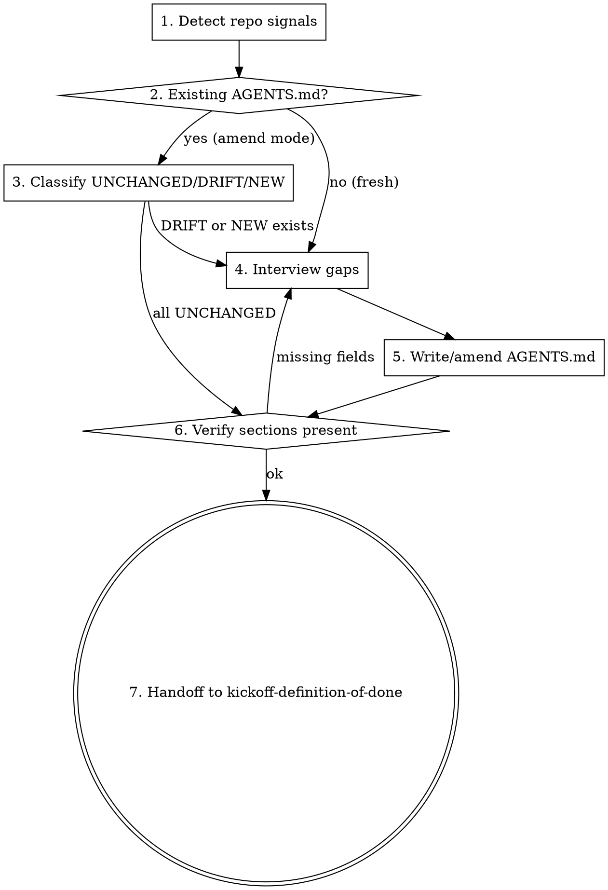

# Kickoff: AGENTS.md

## Overview

AGENTS.md is the project's binding contract for agent work — it tells every future session the tech stack, conventions, commands, Definition of Done, and Invariants. Without it, the agent invents conventions on the fly (Layer 2 failure: context supply missing). This skill generates or amends AGENTS.md by reading the repo first (per L03's "system of record" argument) and only asking the user about fields that cannot be inferred from artifacts.

## Iron Law

**NO PROJECT WORK PROCEEDS PAST PLANNING WITHOUT A POPULATED AGENTS.md.**

If a downstream skill (writing-plans, executing-plans, kickoff-definition-of-done, kickoff-feature-list) detects no AGENTS.md, it must redirect here. The skill never assumes "good defaults" for the user's project.

## Process flow

1. **Detect repo signals.** Scan the project root for the manifest files in the table below. Each found file contributes inferred values for one or more AGENTS.md sections.
2. **Detect existing AGENTS.md.** If `AGENTS.md` exists, read it and switch to amend mode (phase 3 below).
3. **Classify (amend mode only).** For each field, classify as UNCHANGED / DRIFT / NEW. Show the user the counts before interviewing.
4. **Interview gaps.** Ask the user, one question at a time, only about fields that detection cannot resolve OR that detection contradicts existing AGENTS.md (DRIFT). Use multiple-choice when possible.
5. **Write AGENTS.md.** Use `templates/AGENTS.md.tmpl` as the skeleton. Substitute detected + interviewed values into the 5 sections.
6. **Verify.** Run the commands in the Verification checklist. Repeat phase 4 if any verification fails.
7. **Handoff.** Tell the user: "AGENTS.md ready. Run `zeus:kickoff-definition-of-done` next to refine the DoD section into command-verifiable items."

## Detection signal table

| Signal file                                                                              | Yields (which AGENTS.md fields)                                          |
| ---------------------------------------------------------------------------------------- | ------------------------------------------------------------------------ |
| `package.json` `engines.node`, `dependencies`, `devDependencies`                          | Tech Stack: Node version, primary frameworks                              |
| `package.json` `scripts.{install,build,test,lint,typecheck,start,dev}`                    | Commands; DoD bootstrap candidates (test, lint, typecheck)                |
| `pyproject.toml`, `setup.py`, `requirements*.txt`, `Pipfile`                              | Tech Stack: Python; tool configs (pytest, mypy, ruff) drive Commands       |
| `Cargo.toml`                                                                              | Tech Stack: Rust; `cargo build/test/clippy` Commands                      |
| `go.mod`                                                                                  | Tech Stack: Go + minimum version                                          |
| `Gemfile`                                                                                 | Tech Stack: Ruby                                                          |
| `composer.json`                                                                           | Tech Stack: PHP                                                            |
| `pom.xml`, `build.gradle`                                                                 | Tech Stack: Java + build tool                                              |
| `Dockerfile`, `docker-compose.yml`                                                        | Tech Stack: containerized; runtime baseline                                |
| `.github/workflows/*.yml`                                                                 | Commands (CI source of truth); DoD candidates                              |
| `.tool-versions`, `.nvmrc`, `.python-version`, `.ruby-version`                            | Tech Stack: pinned runtime versions (must appear verbatim)                |
| `README.md`                                                                               | One-sentence project description; pull-quote                               |
| `.editorconfig`, `.prettierrc`, `pyproject.toml [tool.ruff]`, `pyproject.toml [tool.black]` | Conventions: code style                                                    |
| `git log` (last 20 commits)                                                               | Conventions: branch + commit format inferred from history                  |

## Interview style

- One question per turn. Multiple-choice when the answer space is small.
- Show the inference, ask to confirm. Example: "Detected Node 20 from `.nvmrc`. AGENTS.md will say 'Node 20.x'. OK? (y/n/edit)"
- Skip what's already correct. Never re-ask in amend mode if classification is UNCHANGED.

Subjective fields (always ask, never invent):

- One-sentence project description (only if README is missing or unclear).
- Branch naming (multiple-choice: `feature/<topic>` / `<topic>-branch` / `<your-name>/<topic>` / custom).
- Commit message format (multiple-choice: conventional commits / freeform / custom).
- Initial DoD bootstrap: "Bootstrap DoD with the detected commands? (You can refine in `kickoff-definition-of-done` next.)"
- Invariants: "What must remain true regardless of any change? Examples: 'no secrets in repo', 'public API stays backward-compatible', 'database migrations are forward-only'." (Free-form list.)

## Anti-rationalization table

| Thought                                                              | Reality                                                                           |
| -------------------------------------------------------------------- | --------------------------------------------------------------------------------- |
| "I can guess the conventions from the codebase, no need to ask."     | Codebases often have a mix of historical conventions. The user knows which is canonical right now. |
| "AGENTS.md is just documentation, it doesn't matter if it's perfect."| AGENTS.md drives every later skill. Wrong DoD → G4 fails. Wrong commands → Layer 3 burn. |
| "I'll skip Invariants — they don't apply here."                       | Every project has invariants. If the user can't name any, that's a data point worth surfacing. |
| "User said 'just generate it', I should skip the interview."          | "Just generate it" is a signal to use detection aggressively. It is NOT permission to invent unverifiable values. |
| "The detected DoD command is broken, I'll fix it silently."           | Show the broken command to the user. They might want a different fix than yours.   |

## Red flags / Stop conditions

- `templates/AGENTS.md.tmpl` is missing from the plugin install. Stop and ask the user to reinstall zeus.
- Detection found zero signal files. Project is genuinely greenfield. Tell the user: "I see no manifests yet. Want me to create AGENTS.md from a blank slate, or wait until you've added your first manifest?"
- User refuses to set Definition of Done bootstrap. Refuse to write AGENTS.md without a DoD section (even bootstrap-only). G4 cannot exist without it.

## Verification checklist

After writing AGENTS.md, run these commands. All must exit 0:

- `[ -f AGENTS.md ]`
- `[ "$(grep -c '^## ' AGENTS.md)" -ge 5 ]` (all 5 required sections present)
- `grep -q '^## Tech Stack$' AGENTS.md`
- `grep -q '^## Conventions$' AGENTS.md`
- `grep -q '^## Commands$' AGENTS.md`
- `grep -q '^## Definition of Done$' AGENTS.md`
- `grep -q '^## Invariants$' AGENTS.md`
- `[ "$(awk '/^## Definition of Done$/,/^## /' AGENTS.md | grep -c '^- \[ \]')" -ge 1 ]` (DoD has ≥ 1 checkbox item)

## Integration

**Predecessor:** None — this is typically the first concrete skill in a project's lifecycle. Routed to from `using-zeus`'s Project entry protocol when no AGENTS.md exists.

**Successor:** `zeus:kickoff-definition-of-done` (refines DoD beyond bootstrap).

**Gates this skill addresses:** G4 (Definition of Done) — establishes the contract that G4 later verifies.

**Defends layer:** 2 (Context supply).
