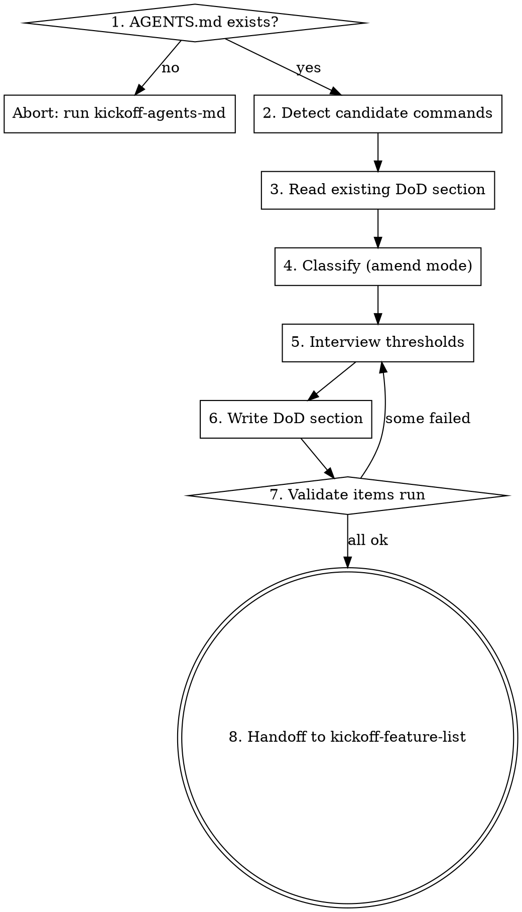

# Kickoff: Definition of Done

## Overview

Definition of Done (DoD) is the project's contract for "completion is the level of evidence that all of these commands return exit code 0." Without an explicit, command-verifiable DoD, the agent invents one — and L09's argument is exactly that this is the most common path to early victory declaration. This skill writes the DoD section as a list of objectively-runnable commands.

## Iron Law

**EVERY DOD ITEM MUST BE A COMMAND THAT RETURNS EXIT CODE 0. NARRATIVE CONDITIONS LIKE "THE FEATURE WORKS" ARE NOT GATES.**

If the user proposes a narrative item, push back. Ask "How would I verify that programmatically?" until you get to a command. If no command exists, the item belongs in `## Invariants`, not DoD.

## Process flow

1. **Precondition check.** If `AGENTS.md` doesn't exist at project root, abort with: "Run `zeus:kickoff-agents-md` first to create AGENTS.md."
2. **Detect candidate commands.** Scan the signals in the table below. Each yields zero or more candidate commands.
3. **Read existing DoD section.** If non-empty (amend mode), parse current items.
4. **Classify (amend mode).** UNCHANGED if existing item maps to a detected command and runs successfully; DRIFT if existing item is broken (non-zero or "command not found"); NEW if detection found a command not in DoD yet.
5. **Interview thresholds.** For each candidate (and DRIFT and NEW), ask the user: "Include this in DoD?" Then thresholds (coverage %, perf budgets) where applicable.
6. **Write DoD section.** Replace the `## Definition of Done` section in AGENTS.md with the new list, keeping all other sections intact.
7. **Validate items run.** Execute each DoD command in a smoke run. If any fail, surface to the user; do not silently strip them.
8. **Handoff.** Tell the user: "DoD locked. Run `zeus:kickoff-feature-list` next to set up the project's feature roadmap."



## Detection signal table

| Signal                                                                                | Yields candidate commands                                              |
| ------------------------------------------------------------------------------------- | ---------------------------------------------------------------------- |
| `package.json` `scripts.test`, `scripts.lint`, `scripts.typecheck`, `scripts.coverage` | `npm test`, `npm run lint`, `npm run typecheck`, `npm run coverage`    |
| `pyproject.toml [tool.pytest]`                                                         | `pytest` (with discovered options)                                      |
| `pyproject.toml [tool.mypy]` or `mypy.ini`                                             | `mypy --strict <package>` or `mypy .`                                   |
| `pyproject.toml [tool.ruff]` or `.ruff.toml`                                           | `ruff check .`                                                          |
| `pyproject.toml [tool.coverage]`                                                       | `coverage run -m pytest && coverage report --fail-under=<X>`            |
| `.github/workflows/*.yml`                                                              | Whatever each workflow's job actually runs (best ground truth)         |
| `Cargo.toml`                                                                           | `cargo test`, `cargo clippy -- -D warnings`, `cargo build --release`   |
| `go.mod`                                                                               | `go test ./...`, `go vet ./...`, `golangci-lint run`                   |
| `Makefile` targets named `test`, `lint`, `check`, `verify`                             | `make test`, `make lint`, etc.                                          |
| AGENTS.md `## Commands` section                                                        | Existing user-documented commands                                       |

## Interview pattern

For each candidate command, ask:

```
Include `<command>` in DoD? (y/n/edit)
```

For coverage commands, follow up with: "Threshold? (default 80)"
For perf commands (only if detected), follow up with: "Performance metric and budget?"

Then ask once more: "Anything else? (e.g., 'OpenAPI spec regenerated', 'database migrations applied') Each item must be a command. Type 'done' to finish."

## Anti-rationalization table

| Thought                                                                | Reality                                                                            |
| ---------------------------------------------------------------------- | ---------------------------------------------------------------------------------- |
| "User said 'the API works' is the DoD."                                | "The API works" is not a command. Push back: ask for `curl ... \| jq` or contract test. |
| "Linter is too noisy, I'll leave it out of DoD."                        | If lint isn't part of DoD, it'll never be enforced. Either fix the noise (config rule changes) or accept the cost. The skill does not silently strip enforcement. |
| "I don't need coverage threshold — agreement is enough."                | "Agreement" doesn't survive the next session. Threshold survives. Pick a number.    |
| "These detected commands probably work, I'll skip phase 7."             | One of them WILL be broken. Phase 7 catches it before locking.                       |
| "Amend mode found a broken item; I'll just delete it."                  | Show the user. They might want to fix it instead of removing — broken DoD is better than no DoD if the fix is cheap. |

## Red flags / Stop conditions

- AGENTS.md missing → abort, redirect to `zeus:kickoff-agents-md`.
- AGENTS.md `## Commands` section empty AND no manifest signals detected. The project doesn't have any verifiable commands. Tell the user: "This project has no command-runnable verification. Either add some to your tooling, or AGENTS.md DoD will be empty (and G4 will be impossible)."
- User wants to add a narrative item ("the design looks clean"). Refuse with the Iron Law explanation.
- Validation phase 7 finds many items broken. Don't write them anyway. Pause and ask the user how to proceed.

## Verification checklist

After writing the DoD section, all of these must hold:

- DoD section exists: `grep -q '^## Definition of Done$' AGENTS.md`
- At least one checkbox item: `[ "$(awk '/^## Definition of Done$/,/^## /' AGENTS.md | grep -c '^- \[ \]')" -ge 1 ]`
- Every item starts with a backtick-fenced command (manual review acceptable; not a hard regex check because some items wrap commands in prose).
- Smoke run of every command exits 0 in the project's current state. (If any fail, the agent must surface, not hide.)

## Integration

**Predecessor:** `zeus:kickoff-agents-md` (writes the AGENTS.md skeleton including an empty/bootstrap DoD section).

**Successor:** `zeus:kickoff-feature-list` (uses the DoD as a source for per-feature DoD subsets).

**Gates this skill addresses:** G4 — this skill writes the contract G4 enforces. Without this skill having run, G4 can never close.

**Defends layer:** 4 (verification feedback).
