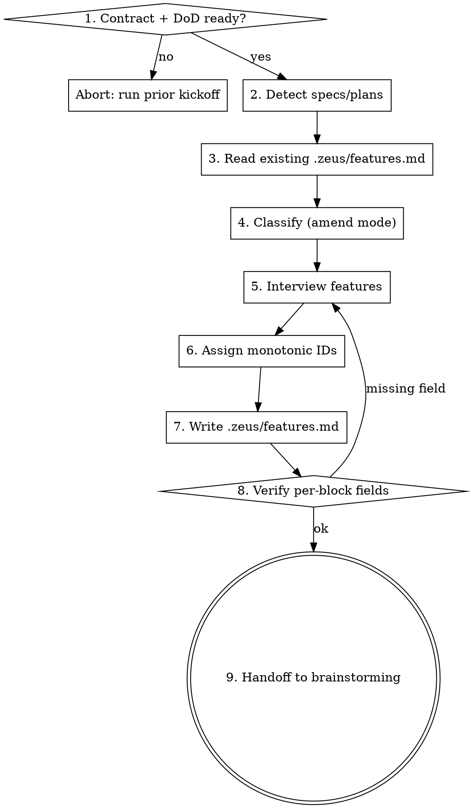

# Kickoff: Feature List

## Overview

L08's argument: feature lists are harness primitives. Without an explicit list of "what we're building", the agent over-reaches (working on Feature B mid-Feature A) or under-finishes (touching three features halfway). .zeus/features.md is the project's roadmap — one entry per feature with stable IDs, status, spec/plan links, and a per-feature DoD subset. Other zeus skills (writing-plans, e2e-gate, observability) read this file to scope work and verify completeness.

## Process flow

1. **Precondition check.** Resolve the project contract per `references/project-contract.md`. If neither `CLAUDE.md` nor `AGENTS.md` exists, OR if the contract's `## Definition of Done` section (or `.zeus/dod.md`) has zero items, abort with: "Run `zeus:kickoff-agents-md` and `zeus:kickoff-definition-of-done` first."
2. **Detect candidate features.** Scan `.zeus/specs/*-design.md` and `.zeus/plans/*.md`. Each existing spec or plan implies a feature.
3. **Read existing .zeus/features.md** if present (amend mode). Otherwise create a new file.
4. **Classify (amend mode).** UNCHANGED for entries that match detection; DRIFT if status changed (e.g., spec age says it should be `done` now); NEW for orphan specs/plans.
5. **Interview features.** For each detected candidate, confirm/edit. Then ask: "Any other features planned? (free-form list, type 'done' to finish.)" For each user-named feature, capture status, spec link if any, plan link if any, DoD subset.
6. **Assign IDs.** Monotonically increase from existing max F-ID, or start at F-001. Never reuse IDs.
7. **Write .zeus/features.md.**
8. **Verify.** Each `## F-NNN: ` block has Status, Spec (or `—`), Plan (or `—`), DoD subset (or `(inherits all from project contract DoD)`).
9. **Handoff.** Tell the user: "Feature roadmap locked. Run `zeus:brainstorming` to design the first planned feature."



## .zeus/features.md format

Top of file (literal):

```markdown
# Features

This file is the canonical roadmap for this project. Each feature has a stable ID (`F-NNN`) and a status. Other zeus skills (writing-plans, e2e-gate, observability) read this file.
```

Per-feature block:

```markdown
## F-001: <feature name>
**Status:** planned | in-progress | done | abandoned
**Spec:** .zeus/specs/<date>-<topic>-design.md  (or `—`)
**Plan:** .zeus/plans/<date>-<topic>.md  (or `—`)
**DoD subset:**
- [ ] <feature-specific command>
- [ ] <inherited from project contract DoD: e.g., pytest passes>
```

ID rules:

- Three digits (`F-001` to `F-999`).
- Monotonically increasing across the file's entire lifetime.
- Abandoned features keep their ID; the ID is never reused.
- Renaming a feature only changes the title text after `F-NNN: `, not the ID.

Status semantics:

- `planned` — agreed scope, no spec or plan yet.
- `in-progress` — has spec and possibly plan; work has started.
- `done` — spec, plan, all tasks complete, DoD subset all green, code merged.
- `abandoned` — explicitly de-scoped; ID stays as a tombstone.

## Anti-rationalization table

| Thought                                                                | Reality                                                                              |
| ---------------------------------------------------------------------- | ------------------------------------------------------------------------------------ |
| "We don't have planned features yet, skip this skill."                  | If you don't know what you're building, don't start. The "no features" answer should send you back to a brainstorm at the project level, not into code. |
| "I'll just maintain features in my head."                               | The next session won't have your head. .zeus/features.md is for cross-session continuity (Layer 5). |
| "Status doesn't matter, only names."                                    | `e2e-gate` (SP5) reads `Status: done` to decide whether to gate that feature. Status IS load-bearing. |
| "Reusing F-005 after it was abandoned is fine."                         | Old git history references F-005 as the abandoned feature. Reuse breaks that audit trail. Use the next free ID. |
| "DoD subset is redundant with the project contract's DoD."             | Per-feature DoD lets `e2e-gate` test only what's in scope. Without it, every check runs for every feature, even ones that don't touch the relevant area. |

## Red flags / Stop conditions

- Project contract missing (neither CLAUDE.md nor AGENTS.md) or DoD empty → abort, redirect.
- User wants to assign their own F-ID (e.g., F-042 because they like the number). Refuse — IDs are agent-managed for stability.
- More than ~30 active features (status not `done` or `abandoned`). Tell the user: "30+ open features is a planning smell; consider closing or merging some before adding more."

## Verification checklist

After writing .zeus/features.md:

- File exists: `[ -f .zeus/features.md ]`
- At least one feature block: `[ "$(grep -c '^## F-[0-9]\{3\}: ' .zeus/features.md)" -ge 1 ]`
- Each block has the four required fields. Verify with this awk pass — every reported line should start with `ok`:
  ```bash
  awk '/^## F-/{if (name && (!status || !spec || !plan)) print "MISSING " name; else if (name) print "ok " name; name=$0; status=""; spec=""; plan=""; next}
       /^\*\*Status:\*\*/{status=$0}
       /^\*\*Spec:\*\*/{spec=$0}
       /^\*\*Plan:\*\*/{plan=$0}
       END {if (name && (!status || !spec || !plan)) print "MISSING " name; else if (name) print "ok " name}' .zeus/features.md
  ```

## Integration

**Predecessor:** `zeus:kickoff-definition-of-done` (DoD must exist for per-feature DoD subset to inherit from).

**Successor:** `zeus:brainstorming` (start designing the first planned feature).

**Gates this skill addresses:** None directly — but feeds G5 (E2E pipeline) by giving `e2e-gate` per-feature scope, and feeds G7 (handoff) by giving observability per-feature attribution.

**Defends layer:** 1 (Task specification).

**Read by:** `zeus:writing-plans`, `zeus:e2e-gate`, `zeus:observability`, `zeus:session-init`.
