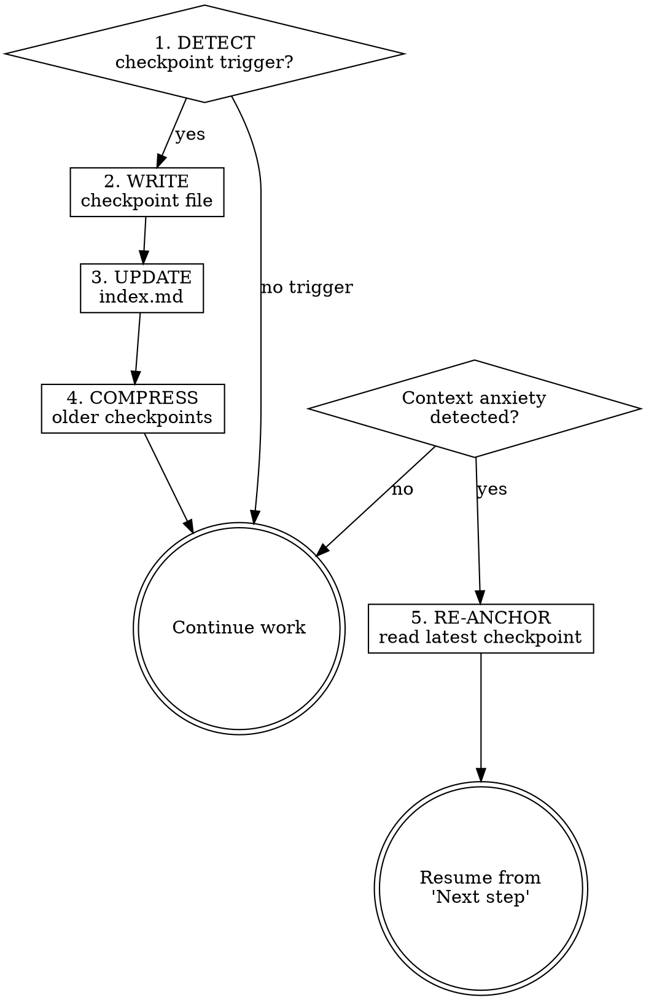

# Long-Task Continuity

## Overview

L05 showed that agents abandon or redo work on long tasks not because the task is hard, but because context pressure makes them forget what they already accomplished. The symptom is "context anxiety" — the agent starts hedging, re-reading files it already read, or restarting subtasks it already finished. The fix is periodic checkpointing: write down where you are so you can re-anchor from the checkpoint instead of re-deriving from scratch.

## When to checkpoint

Checkpoint when any of these conditions is true:

- A plan task completes (natural boundary).
- The agent has been working for 5+ turns without a checkpoint.
- The agent is about to switch to a different subtask.
- Context compaction is about to happen (if detectable).
- The agent notices itself re-reading files it already processed.

Do not checkpoint on every turn — that wastes tokens on write overhead. Checkpoint at meaningful boundaries.

## Checkpoint format

Write to `.zeus/memory/checkpoints/` using `memory-management` conventions:

```yaml
---
type: checkpoint
temperature: hot
created: 2026-04-28T14:30:00
last_accessed: 2026-04-28T14:30:00
compression_level: 0
tags: [sp6, task3, session-handoff]
---

## Position
Task 3 of 8 in SP6 plan. Tasks 1-2 committed on branch sp6-session-continuity.

## Completed this session
- T1: memory-management skill created and committed (1f10d10)
- T2: session-init skill created and committed (5f02042)

## Current state
- Working on T3: long-task-continuity
- Branch: sp6-session-continuity, 2 commits ahead of main

## Next step
- Finish T3, then T4 (session-handoff), T5 (clean-state)

## Non-obvious context
- User requires LLMLingua-inspired compression in memory system
- User requires instant-capture of corrections as lessons
- No external MCP dependency — all memory is file-based
```

Key rules:
- **Positio in the plan, what task number.
- **Completed** — what is done, with commit SHAs if available.
- **Current state** — what is in progress right now.
- **Next step** — what comes immediately after.
- **Non-obvious context** — anything a fresh reader would miss.

## Re-anchoring

When the agent feels context pressure (re-reading files, losing track of progress):

1. **Read the latest checkpoint** from `.zeus/memory/checkpoints/`.
2. **Read the plan** to confirm task order.
3. **Resume from the checkpoint's "Next step"** — do not restart from the beginning.

Re-anchoring is not failure. It is the designed recovery path. An agent that re-anchors from a checkpoint is faster than one that re-derives from raw context.

## Context anxiety signals

Recognize these as signs that a checkpoint read (or write) is overdue:

| Signal | What it means |
|--------|---------------|
| Re-reading a file the agent already processed | Context is fading — re-anchor from checkpoint |
| Asking the user "where were we?" | State is lost — read the latest checkpoint |
| Restarting a subtask that was already completed | Checkpoint was not written — write one now, then re-anchor |
| Hedging language ("I think we did...", "if I recall...") | Uncebout state — read checkpoint to confirm |
| Skipping plan tasks or doing them out of order | Lost track of position — read plan + checkpoint |

## Process flow

1. **DETECT** — Recognize a checkpoint trigger (task boundary, turn count, anxiety signal).

2. **WRITE CHECKPOINT** — Call `memory-management` to write a checkpoint file with the standard format.

3. **UPDATE INDEX** — Append to `.zeus/memory/index.md`.

4. **COMPRESS OLD CHECKPOINTS** — If a newer checkpoint for the same plan exists, compress the older one to level 1. If two newer checkpoints exist, compress to level 2.

5. **RE-ANCHOR** (when needed) — Read the latest checkpoint. Resume from its "Next step".



## Checkpoint lifecycle

```
Created (compression_level: 0, temperature: hot)
  → Task completes: stays at level 0 until superseded
    → Newer checkpoint written: compress to level 1 (warm)
      → Two newer checkpoints exist: compress to level 2 (cold)
        → Sprint closes: archive or evict
```

Checkpoints are disposable by design. Unlike lessons, they lose value quickly as work progresses. Aggreve compression is correct here.

## Anti-rationalization table

| Thought | Reality |
|---------|---------|
| "I can keep track in my head." | You cannot. Context compaction will erase your working memory. Write the checkpoint. |
| "Checkpointing slows me down." | A checkpoint takes 30 seconds. Re-deriving lost state takes 10 minutes. |
| "I just finished one task, no need to checkpoint yet." | Task boundaries are the best checkpoint triggers. Write it now. |
| "I'll checkpoint at the end." | If context compacts before the end, you lose everything. Checkpoint at boundaries. |
| "Re-anchoring means I failed." | Re-anchoring is the designed recovery path. Using it is correct behavior. |

## Red flags / Stop conditions

- Re-reading files already processed without checking for a checkpoint → stop, read the checkpoint first.
- Five turns without a checkpoint on a multi-task plan → stop, write a checkpoint now.
- About to restart a completed subtask → stop, check if a checkpoint confirms it is done.
- Checkpoint file missing frontmatter → stop, every checkpoint needs metadata for compression lifecycle.

## Verification checklist

- [ ] Checkpoints written at task boundaries.
- [ ] Each checkpoint has: position, completed, current state, next step, non-obvious context.
- [ ] Older checkpoints compressed when superseded.
- [ ] Re-anchoring used when context anxiety signals appear.
- [ ] Checkpoint files have valid frontmatter.

## Integration

- **Called during:** `zeus:executing-plans` (after each task), `zeus:subagent-driven-development` (between subtask dispatches).
- **Calls:** `zeus:memory-management` for checkpoint writes and compression.
- **Read by:** `zeus:session-init` (loads latest checkpoint if session resumes mid-plan).
- **Complements:** `zeus:session-handoff` (handoff is cross-sespoint is within-session).
**Gates addressed:** none directly — continuity is infrastructure, not a gate.
- **Defends layer:** 5 (state management).
