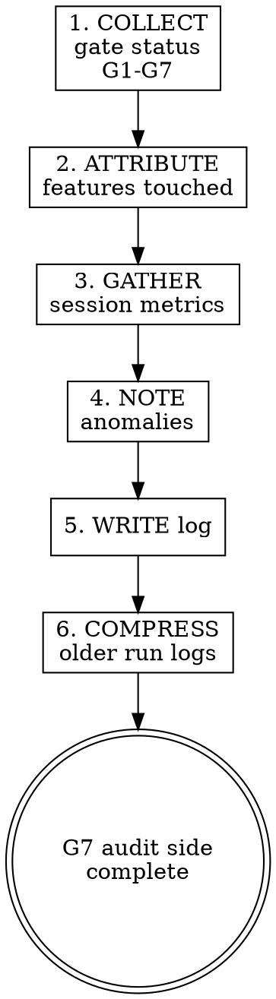

# Observability

## Overview

L11 argued that observability belongs inside the harness, not bolted on after the fact. An agent that finishes work but leaves no audit trail forces the next session (or a human reviewer) to reconstruct what happened from git log archaeology. This skill produces a structured run log at session end — which gates passed, which failed, which features were touched, and how the session's time was spent. The run log is the audit side of G7, complementing session-handoff (narrative) and clean-state (cleanup).

## Iron Law

**NO SESSION ENDS WITHOUT A RUN LOG. IF YOU CANNOT PRODUCE ONE, G7 STAYS CLOSED.**

## Run log format

Write to `.zeus/memory/handoffs/` alongside the handoff memo, with a `-runlog` suffix:

```yaml
---
type: handoff
temperature: hot
created: 2026-04-28
last_accessed: 2026-04-28
compression_level: 0
tags: [runlog, sp7]
---

## Gate Status

| Gate | Status | Evidence summary |
|------|--------|-----------------|
| G1 | PASS | 5 files changed, 3 created |
| G2 | PASS | test suite: 12 passed, 0 failed (red→green on auth module) |
| G3 | PASS | `npm test` exit 0, full output captured |
| G4 | PASS | all 4 DoD items exit 0 |
| G5 | PASS | E2E: login→dashboard→logout pipeline green |
| G6 | PASS | spec review approved, code quality review approved |
| G7 | PENDING | run log in progress |

## Features Touched

| Feature ID | Feature name | Action |
|------------|-------------|--------|
| F-003 | User authentication | Implemented |
| F-007 | Dashboard layout | Modified (dependency) |

## Session Metrics

- **Commits:** 5
- **Files changed:** 8 (3 created, 5 modified)
- **First commit:** 2026-04-28T09:15:00
- **Last commit:** 2026-04-28T11:42:00
- **Estimated duration:** ~2.5 hours
- **Debugging cycles:** 1 (auth token expiry — resolved in 15 min)

## Anomalies

- None
```

## Three mandatory sections

| Section | Purpose | Source |
|---------|---------|--------|
| **Gate Status** | Which gates passed, failed, or were skipped | Agent's own tracking through the 7-gate cascade |
| **Features Touched** | Per-feature attribution from .zeus/features.md | Cross-reference changed files against .zeus/features.md feature scope |
| **Session Metrics** | Quantitative summary | `git log --oneline`, `git diff --stat`, commit timestamps |

## Optional sections

| Section | When to include |
|---------|-----------------|
| **Anomalies** | When something unexpected happened: flaky test, environment issue, scope change mid-session |
| **Debugging Cycles** | When systematic-debugging was invoked — what was the root cause, how long did it take |
| **Review Findings** | When code review surfaced issues — summary of Critical/Important items and resolution |

## Process flow

1. **COLLECT GATE STATUS** — Walk through G1-G7. For each gate, record PASS / FAIL / SKIP and a one-line evidence summary. Do not paste full output — summarize.

2. **ATTRIBUTE FEATURES** — Read `.zeus/features.md` if present. Cross-reference `git diff --stat` against feature scope to determine which features were touched. If no .zeus/features.md exists, list changed directories instead.

3. **GATHER METRICS** — Run `git log --oneline` and `git diff --stat` for the session's commit range. Extract commit count, file count, timestamps.

4. **NOTE ANOMALIES** — Record anything unexpected: debugging detours, scope changes, environment issues, flaky tests.

5. **WRITE RUN LOG** — Write to `.zeus/memory/handoffs/` using the format above. Update `index.md`.

6. **COMPRESS OLDER RUN LOGS** — Apply the same time-decay compression as handoff memos: latest uncompressed, previous at level 1, older at level 2.



## Gate status guidelines

| Gate | How to determine status |
|------|------------------------|
| G1 | `git diff --stat` shows changes → PASS. No changes → SKIP (nothing was implemented). |
| G2 | TDD red→green evidence exists in context → PASS. No tests written → SKIP. Tests written but no red→green flip → FAIL. |
| G3 | Verification command was run fresh with output captured → PASS. Output was paraphrased or not run → FAIL. |
| G4 | All DoD items from AGENTS.md exit 0 → PASS. Any DoD item fails → FAIL. No AGENTS.md → SKIP. |
| G5 | E2E pipeline ran start-to-finish → PASS. No E2E test exists → SKIP. E2E failed → FAIL. |
| G6 | Two-stage review completed and approved → PASS. Review not requested → SKIP. Review has open Critical/Important → FAIL. |
| G7 | Run log + handoff memo + clean state all present → PASS. Any missing → FAIL. |

SKIP is not failure — it means the gate was not applicable to this session's scope. A session that only fixes a typo legitimately skips G2 and G5.

## Anti-rationalization table

| Thought | Reality |
|---------|---------|
| "The git log is enough observability." | Git log shows commits, not gate status, feature attribution, or anomalies. Write the run log. |
| "This was a small session, no run log needed." | Small sessions still need audit trails. The run log takes 2 minutes. |
| "I'll mark all gates as PASS." | Only mark PASS if evidence exists. SKIP is honest. False PASS is worse than no log. |
| "Feature attribution is too much work." | `git diff --stat` + .zeus/features.md cross-reference takes 30 seconds. |
| "Nobody reads run logs." | The next session-init reads them. Future you reads them. Write it. |

## Red flags / Stop conditions

- About to end session without a run log → stop, write it.
- Marking a gate PASS without evidence → stop, check the evidence or mark SKIP.
- Run log missing Gate Status section → stop, this is mandatory.
- Run log missing Features Touched section → stop, this is mandatory.
- Older run logs accumulating without compression → stop, compress per time-decay rules.

## Verification checklist

- [ ] Run log written to `.zeus/memory/handoffs/`.
- [ ] Gate Status section present with all 7 gates accounted for (PASS / FAIL / SKIP).
- [ ] Features Touched section present.
- [ ] Session Metrics section present.
- [ ] `index.md` updated.
- [ ] Older run logs compressed per time-decay rules.
- [ ] No false PASS — every PASS has evidence.

## Integration

- **Complement:** `zeus:session-handoff` (narrative) + `zeus:clean-state` (cleanup). All three must pass for G7.
- **Reads:** `.zeus/features.md` (from `zeus:kickoff-feature-list`) for per-feature attribution.
- **Calls:** `zeus:memory-management` for run log writes and compression.
- **Consumed by:** `zeus:session-init` in the next session (run logs provide historical context).
- **Gates addressed:** G7 (audit side) — run log is one of three requirementr G7 to close.
- **Defends layer:** 5 (state management).
