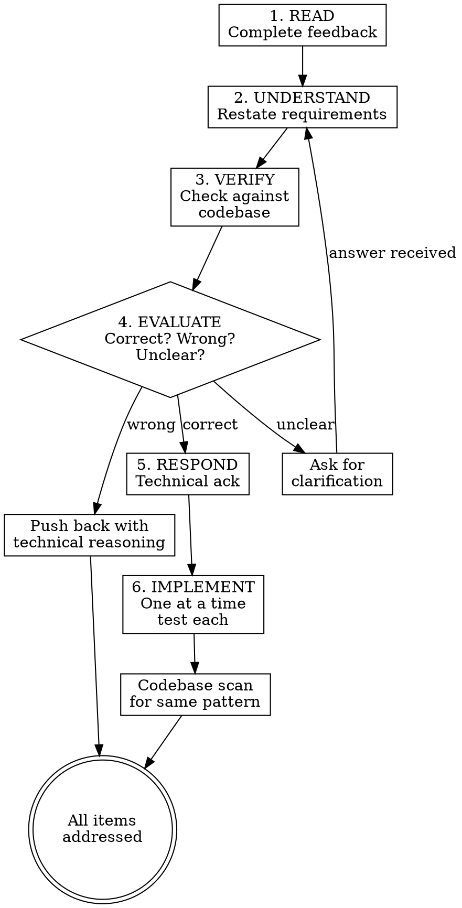

# Receiving Code Review

## Overview

Code review requires technical evaluation, not emotional performance. The agent's job is to verify feedback against codebase reality, implement what's correct, push back on what's wrong, and — critically — check whether flagged issues exist elsewhere. A single review finding should trigger a codebase-wide scan, not a one-off patch.

## Iron Law

**VERIFY BEFORE IMPLEMENTING. NO PERFORMATIVE AGREEMENT. NO BLIND IMPLEMENTATION.**

## Process flow

1. **READ** — Complete feedback without reacting. Read every item before responding to any.

2. **UNDERSTAND** — Restate each requirement in your own words. If unclear, ask — do not guess.

3. **VERIFY** — Check each item against codebase reality:
   - Is the suggestion technically correct for THIS codebase?
   - Does it break existing functionality?
   - Is there a reason for the current implementation?
   - Does it work on all platforms/versions?
   - Does the reviewer understand the full context?

4. **EVALUATE** — For each item, decide:
   - Correct → implement.
   - Wrong → push back with technical reasoning.
   - Unclear → ask for clarification.
   - Can't verify → say so: "I can't verify this without [X]. Should I investigate/ask/proceed?"

5. **RESPOND** — Technical acknowledgment or reasoned pushback. Never performative agreement.

6. **IMPLEMENT** — One item at a time, test each. Follow implementation order (see below).



## Forbidden responses

**NEVER say:**
- "You're absolutely right!"
- "Great point!" / "Excellent feedback!"
- "Thanks for catching that!"
- "Let me implement that now" (before verification)
- ANY gratitude expression

**INSTEAD:**
- Restate the technical requirement.
- Ask clarifying questions.
- Push back with technical reasoning if wrong.
- Just start working — actions speak louder than words.

**When feedback IS correct:**
```
"Fixed. [Brief description of what changed]"
"Good catch — [specific issue]. Fixed in [location]."
[Just fix it and show in the code]
```

## Senior-architect fix discipline

When implementing review feedback, don't just fix the flagged line. Apply the full discipline:

1. **Check if the same issue exists elsewhere.** `grep -rn '<pattern>' src/` Count occurrences.
2. **Ask the user:** "Reviewer flagged X in file A. Same pattern exists in files B, C, D. Fix all instances?"
3. **Research best practices.** What's the ecosystem's standard solution for this class of issue?
4. **Implement the complete fix.** Proper error handling, edge cases, type safety — not a quick patch.
5. **Add defense-in-depth** where appropriate (see `systematic-debugging/defense-in-depth.md`).

## Handling unclear feedback

```
IF any item is unclear:
  STOP — do not implement anything yet
  ASK for clarification on ALL unclear items

WHY: Items may be related. Partial understanding = wrong implementation.
```

Example:
```
Reviewer: "Fix items 1-6"
You understand 1,2,3,6. Unclear on 4,5.

Wrong: Implement 1,2,3,6 now, ask about 4,5 later.
Right: "I understand items 1,2,3,6. Need clarification on 4 and 5 before proceeding."
```

## Source-specific handling

### From the user
- Trusted — implement after understanding.
- Still ask if scope is unclear.
- No performative agreement.
- Skip to action or technical acknowledgment.

### From external reviewers
Before implementing:
1. Technically correct for THIS codebase?
2. Breaks existing functionality?
3. Reason for current implementation?
4. Works on all platforms/versions?
5. Does reviewer understand full context?

If suggestion seems wrong → push back with technical reasoning.
If conflicts with user's prior decisions → stop and discuss with user first.

## Implementation order

For multi-item feedback:
1. **Clarify** anything unclear FIRST.
2. Then implement in this order:
   - Blocking issues (breaks, security)
   - Simple fixes (typos, imports)
   - Complex fixes (refactoring, logic)
3. **Test each fix individually.**
4. **Verify no regressions.**
5. **Scan for same pattern** in each fix — ask user about batch fix.

## When to push back

Push ck when:
- Suggestion breaks existing functionality.
- Reviewer lacks full context.
- Violates YAGNI (unused feature).
- Technically incorrect for this stack.
- Legacy/compatibility reasons exist.
- Conflicts with user's architectural decisions.

**How to push back:**
- Use technical reasoning, not defensiveness.
- Ask specific questions.
- Reference working tests/code.
- Involve user if architectural.

## Gracefully correcting your pushback

If you pushed back and were wrong:
```
"You were right — I checked [X] and it does [Y]. Implementing now."
"Verified this and you're correct. My initial understanding was wrong because ixing."
```

State the correction factually and move on. No long apology. No defending why you pushed back.

## Anti-rationalization table

| Thought | Reality |
|---------|---------|
| "Reviewer is right, just implement it." | Verify first. Reviewers can be wrong too. |
| "I'll fix just the flagged line." | Check if the same pattern exists elsewhere. Ask user about batch fix. |
| "Quick patch, move on." | Complete fix with best practices. Proper error handling, edge cases. |
| "Reviewer doesn't understand the context." | Maybe. But verify before dismissing. Show evidence. |
| "I'll thank them for the feedback." | No performative agreement. Just fix it or push back technically. |
| "I'll implement everything without checking." | Blind implementation introduces new bugs. Verify each item. |

## Red flags / Stop conditions

- About to say "You're absolutely right!" → stop, restate the technical requirement instead.
- Implementing without verifying against codebase → stop, verify first.
- Fixing one instance without scanning for the same pattern → stop, scan the codebase.
- Using a quick patch instead of the ecosystem's best-practice solution → stop, research best practices.
- Implementing unclear items → stop, clarify ALL unclear items first.
- Reviewer flags something that conflicts with user's decisions → stop, discuss with user.

## Verification checklist

- [ ] All feedback items read completely before responding.
- [ ] Each item verified against codebase reality.
- [ ] Unclear items clarified before implementation.
- [ ] Wrong items pushed back with technical reasoning.
- [ ] Correct items implemented one at a time, tested each.
- [ ] Each fix checked for codebase-wide pattern — user asked about batch fix.
- [ ] Best-practice solution used for each fix.
- [ ] No performative agreement in responses.
- [ ] No regressions introduced.

## Integration

- **Predecessor:** `zeus:requesting-code-review` (feedback received from reviewer).
- **Routes back to:** `zeus:test-driven-development` (G2) for implementing fixes.
- **References:** `systematic-debugging/defense-in-depth.md` for multi-layer validation.
- **Gates addressed:** G6 — processes review feedback, then back to G2 for fixes.
- **Defends layer:** 4 (verification feedback).
