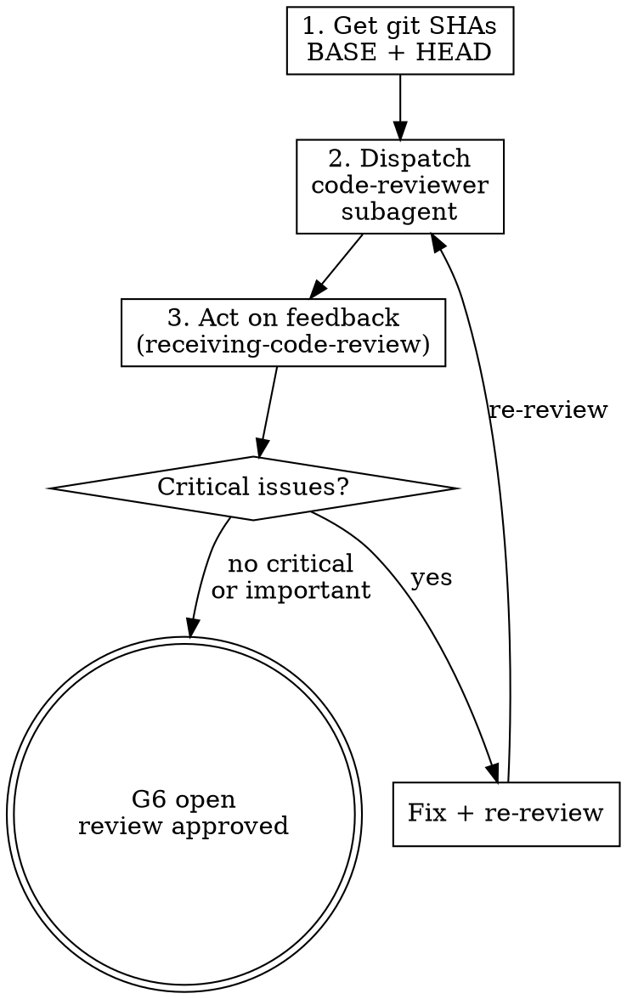

# Requesting Code Review

## Overview

Code review catches issues before they cascade. Dispatching a structured review after each task or before merge is cheaper than debugging in production. L09's argument applies here too: the agent's self-assessment is not independent verification. A fresh reviewer with no context pollution sees what the implementer missed.

## Process flow

1. **Get git SHAs** for the review range.
   ```bash
   BASE_SHA=$(git merge-base HEAD main)   # or specific commit before work
   HEAD_SHA=$(git rev-parse HEAD)
   ```

2. **Dispatch code-reviewer subagent** using `./code-reviewer-prompt.md` template. Fill in:
   - `{WHAT_WAS_IMPLEMENTED}` — what you just built
   - `{PLAN_OR_REQUIREMENTS}` — what it should do (task from plan)
   - `{BASE_SHA}` — starting commit
   - `{HEAD_SHA}` — ending commit
   - `{DESCRIPTION}` — brief summary
   - `{AGENTS_MD_CONVENTIONS}` — relevant conventions and file-size thresholds

3. **Act on feedback** using `zeus:receiving-code-review`:
   - Fix Critical issues immediately.
   - Fix Important issues before proceeding.
   - Note Minor issues for later.
   - Push back with technical reasoning if reviewer is wrong.
   - **Check if flagged patterns exist elsewhere** — reviewer prompt asks for codebase-wide pattern flags.



## When to request review

**Mandatory:**
- After each task in subagent-driven development (per-task two-stage review).
- After completing a major feature.
- Before merge to main.

**Optional but valuable:**
- When stuck (fresh perspective).
- Before refactoring (baseline check).
- After fixing a complex bug.

## Senior-architect fix discipline in reviews

The code-reviewer prompt includes: **"Flag anti-patterns that appear elsewhere in the codebase — not just in this diff."**

When the reviewer flags a pattern:
1. Read the reviewer's codebase-wide findings.
2. Ask the user: "Reviewer found this pattern in N other places. Fix all instances?"
3. If approved, fix all instances using the ecosystem's best-practice solution.

## Anti-rationalization table

| Thought | Reality |
|---------|---------|
| "It's simple, skip review." | Simple code has bugs too. Review takes minutes. |
| "I self-reviewed already." | Self-review is not independent review. Fresh eyes catch different things. |
| "Review will slow me down." | Review catches issues early. Debugging later is slower. |
| "Reviewer found only minor issues." | Minor issues compound. Fix them. |
| "I'll review at the end instead of per-task." | Issues compound across tasks. Review early, review often. |

## Red flags / Stop conditions

- Skipping review because "it's simple" → stop, request review.
- Ignoring Critical issues from reviewer → stop, fix them.
- Proceeding with unfixed Important issues → stop, fix them.
- Reviewer flags codebase-wide pattern and agent ignores it → stop, ask user about batch fix.
- Arguing with valid technical feedback → stop, use `zeus:receiving-code-review` discipline.

## Verification checklist

- [ ] Git SHAs identified (BASE and HEAD).
- [ ] Code-reviewer subagent dispatched with complete template.
- [ ] All Critical issues fixed.
- [ ] All Important issues fixed.
- [ ] Codebase-wide pattern flags addressed (asked user about batch fix).
- [ ] Re-review passed after fixes (if any).

## Integration

- **Called by:** `zeus:executing-plans` (before merge), `zeus:subagent-driven-development` (per-task review), `zeus:e2e-gate` (after G5 passes).
- **Feedback processed by:** `zeus:receiving-code-review`.
- **Template:** `./code-reviewer-prompt.md`.
- **Gates addressed:** G6 — two-stage code review (spec compliance + code quality).
- **Defends layer:** 4 (verification feedback).
