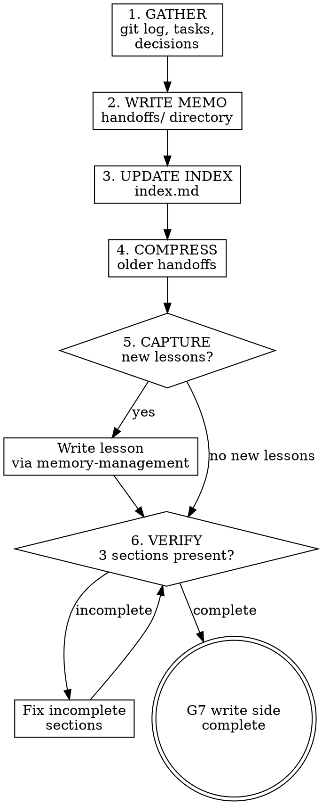

# Session Handoff

## Overview

L12 argued that every session must leave a clean state because the cost of context loss compounds across sessions. A project without a handoff memo forces the next agent (or human) to reverse-engineer what happened, what remains, and why certain decisions were made. This skill produces that memo — the write side of G7. Its complement `clean-state` handles the cleanup side.

## Iron Law

**NO SESSION ENDS WITHOUT A HANDOFF MEMO. IF YOU CANNOT WRITE ONE, THE SESSION IS NOT DONE.**

## Handoff memo format

Write to `.zeus/memory/handoffs/` with a date-prefixed filename:

```yaml
---
type: handoff
temperature: hot
created: 2026-04-28
last_accessed: 2026-04-28
compression_level: 0
tags: [sp6, session-continuity]
---

## What Changed
- Created memory-management skill (skills/memory-management/SKILL.md)
- Created session-init skill (skills/session-init/SKILL.md)
- Created long-task-continuity skill (skills/long-task-continuity/SKILL.md)
- Branch: sp6-session-continuity, 3 commits ahead of main

## What Remains
- T4: session-handoff (this skill — in progress)
- T5: clean-state
- T6: update using-zeus forward ref
- T7: version bump 0.5.0 → 0.6.0
- T8: final verification

## Non-Obvious Context
- User requires LLMLingua-inspired compression — three-tier temperature model
- User requires instant-capture of corrections as lessons (never compressed)
- No external MCP dependency — all memory is file-based in .zeus/memory/
- Lessons are immutable except by user — never auto-compress or auto-evict

## Open Decisions
- None pending

## Risks / Blockers
- None identified
```

## Three mandatory sections

Every handoff memo must contain at least these three sections. Omitting any one means the memo is incomplete and G7 stays closed.

| Section | Purpose | What to include |
|---------|---------|-----------------|
| **What Changed** | The next session knows what happened | Files created/modified, commits, branches, features added, bugs fixed |
| **What Remains** | The next session knows what to do | Open tasks, known issues, next steps with enough detail to act on |
| **Non-Obvious Context** | The next session avoids re-learning surprises | Decisions that would surprise a new reader, workarounds, constraints, user preferences discovered during this session |

## Optional sections

| Section | When to include |
|---------|-----------------|
| **Open Decisions** | When a design question was raised but not resolved |
| **Risks / Blockers** | When something might prevent the next session from proceeding |
| **Lessons Learned** | When the session surfaced a new insight — but prefer writing a `lesson` memory instead |

## Process flow

1. **GATHER** — Review what happened this session: git log, completed tasks, decisions made, issues encountered.

2. **WRITE MEMO** — Write the handoff file to `.zeus/memory/handoffs/` using the format above. Include all three mandatory sections.

3. **UPDATE INDEX** — Append to `.zeus/memory/index.md`.

4. **COMPRESS OLDER HANDOFFS** — If a previous handoff exists at compression_level 0, compress it to level 1. If two newer handoffs exist, compress to level 2.

5. **CAPTURE NEW LESSONS** — If the session surfaced user corrections that were not yet recorded as lessons, write them now via `memory-management` instant-capture.

6. **VERIFY COMPLETENESS** — Check that all three mandatory sections are present and non-empty. If any is missing, the memo is incomplete — fix it before proceeding.



## What NOT to put in a handoff

- Full code listings — the code is in git.
- Detailed debugging logs — summarize the conclusion, not the journey.
- Emotional commentary ("this was frustrating") — stick to facts.
- Information already in the project contract (CLAUDE.md / AGENTS.md) or `.zeus/features.md` — do not duplicate project-level docs.

The handoff is a bridge between sessions, not a project document. Keep it focused on what the next session needs to know that it cannot derive from reading the code and project docs.

## Anti-rationalization table

| Thought | Reality |
|---------|---------|
| "The code is self-documenting, no handoff needed." | Code shows what IS, not what REMAINS or what is NON-OBVIOUS. Write the memo. |
| "I'll remember next session." | You will not. Next session starts with zero context. Write the memo. |
| "Nothing non-obvious happened." | If you think that, you are not looking hard enough. Every session has context that is not in the code. |
| "The user can just read the git log." | Git log shows commits, not intent, remaining work, or surprises. Write the memo. |
| "I'll write it later." | Later does not exist. The session is ending. Write it now. |

## Red flags / Stop conditions

- Session ending without a handoff memo → stop, write the memo before any completion claim.
- Handoff memo missing "What Remains" → stop, this is the most critical section for the next session.
- Handoff memo missing "Non-Obvious Context" → stop, think harder about what would surprise a fresh reader.
- User corrections from this session not captured as lessons → stop, write lessons before handoff.

## Verification checklist

- [ ] Handoff memo written to `.zeus/memory/handoffs/`.
- [ ] All three mandatory sections present and non-empty.
- [ ] Older handoffs compressed per time-decay rules.
- [ ] New lessons captured if any user corrections occurred this session.
- [ ] `index.md` updated with handoff entry.
- [ ] Memo contains enough detail for a fresh agent to resume without asking the user.

## Integration

- **Predecessor:** task completion or user signals session end.
- **Complement:** `zeus:clean-state` (handoff writes what to remember, clean-state removes what to forget).
- **Calls:** `zeus:memory-management` for writes, compression, and lesson capture.
- **Consumed by:** `zeus:session-init` in the next session.
- **Gates addressed:** G7 (write side) — handoff memo is one of two requirements for G7 to close.
- **Defends layer:** 5 (state management).
