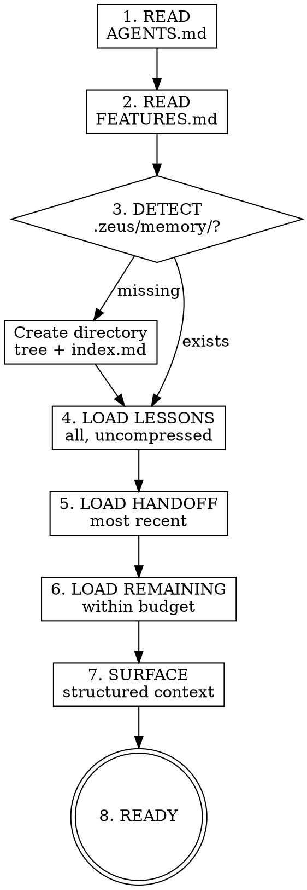

# Session Init

## Overview

L06 argued that initialization needs its own phase because agents that skip it waste their first 20 minutes rediscovering context a previous session already established. This skill is the concrete implementation: read the project contract, load memory within budget, restore the last handoff, and surface every lesson the user has ever recorded. The agent enters the working phase with full context instead of a blank slate.

## Process flow

1. **READ PROJECT CONTRACT** — Read `AGENTS.md` at the project root. Treat its `## Definition of Done` as the binding completion contract. If no `AGENTS.md` exists, note this and suggest running `zeus:kickoff-agents-md`.

2. **READ FEATURES** — Read `FEATURES.md` if present. This is the feature inventory from `zeus:kickoff-feature-list`.

3. **DETECT MEMORY** — Check if `.zeus/memory/` exists.
   - Exists → proceed to step 4.
   - Missing → create the directory tree (`lessons/`, `decisions/`, `checkpoints/`, `handoffs/`, `compressed/`) and an empty `index.md`. Log: "First session — memory initialized."

4. **LOAD LESSONS FIRST** — Read all files in `.zeus/memory/lessons/`. These are user corrections with `temperature: hot`. Load them in full, no compression. This is non-negotiable — lessons are the highest-priority memory class.

5. **LOAD LATEST HANDOFF** — Find the most recent file in `.zeus/memory/handoffs/` (by filename date or `created` frontmatter). Load it uncompressed. This tells the agent what the previous session accomplished and what remains.

6. **LOAD REMAINING MEMORY WITHIN BUDGET** — Using the token budget from `memory-management`:
   - Subtract tokens already used by lessons and handoff.
   - Load Warm tier (decisions) sorted by `last_accessed` descending, until budget exhausted.
   - Load Cold tier (index lines only) with remaining budget.

7. **SURFACE CONTEXT** — Present to the agent (not necessarily to the user) a structured summary:
   - Active lessons (user corrections to honor).
   - Last handoff summary (where we left off).
   - Key decisions still in effect.
   - DoD from AGENTS.md.

8. **READY** — Initialization complete. The agent may now proceed to the user's request.



## First-use initialization

When `.zeus/memory/` does not exist, session-init creates:

```
.zeus/memory/
├── index.md          # empty, with header: "# Zeus Memory Index"
├── lessons/          # empty
├── decisions/        # empty
├── checkpoints/      # empty
├── handoffs/         # empty
└── compressed/       # empty
```

The agent should also check whether `.zeus/` is in `.gitignore`. If not, inform the user: "`.zeus/memory/` will be tracked by git. Add `.zeus/` to `.gitignore` if you prefer memory to stay local."

## Handoff restoration

The latest handoff memo contains three sections the agent should internalize:

1. **What changed** — files modified, features added, bugs fixed.
2. **What remains** — open tasks, known issues, next steps.
3. **Non-obvious context** — decisions that would surprise a new reader, gotchas, workarounds in place.

If no handoff exists (first session or handoffs were cleaned), the agent proceeds without historical context — this is normal for new projects.

## Lesson surfacing

Lessons are the agent's "do not repeat" list. During initialization, the agent reads every lesson and holds them as active constraints for the entire session. Examples:

- "Do not write custom lint scripts — use ecosystem-standard tools."
- "Approach fixes from senior-architect perspective — scan codebase for similar issues."
- "Never auto-merge to main — always present options to the user."

These are not suggestions. They are corrections the user has already made. Violating a recorded lesson is a Layer 5 failure.

## Anti-rationalization table

| Thought | Reality |
|---------|---------|
| "I know this project, skip init." | You have zero context from prior sessions. Read the memory. |
| "Lessons are just guidelines." | Lessons are user corrections. Violating them is a repeat failure. |
| "I'll read AGENTS.md later if needed." | AGENTS.md is the completion contract. Read it first, not when you're stuck. |
| "No handoff exists, so nothing to restore." | Correct — proceed without. But do not skip the check. |
| "Memory loading is slow, skip it." | Memory loading is budgeted. It costs a fixed token amount. Always load. |

## Red flags / Stop conditions

- About to start work without reading AGENTS.md → stop, read it first.
- About to start work without loading lessons → stop, lessons are mandatory.
- Memory budget exceeded during loading → stop, follow budget-control rules from `memory-management`.
- `.zeus/memory/` exists but `index.md` is missing or corrupt → stop, rebuild index from directory contents.

## Verification checklist

- [ ] `AGENTS.md` read (or absence noted with suggestion to create).
- [ ] `FEATURES.md` read if present.
- [ ] `.zeus/memory/` exists (created if first session).
- [ ] All lessons loaded in full.
- [ ] Latest handoff loaded if present.
- [ ] Remaining memory loaded within token budget.
- [ ] Structured context summary available to agent.

## Integration

- **Predecessor:** `zeus:using-zeus` (SessionStart hook loads using-zeus, which routes to session-init).
- **Calls:** `zeus:memory-management` for all memory read operations.
- **Reads:** `AGENTS.md` (from `zeus:kickoff-agents-md`), `FEATURES.md` (from `zeus:kickoff-feature-list`).
- **Consumes:** handoff memos written by `zeus:session-handoff`.
- **Successor:** user's requested task, routed through `zeus:brainstorming` or direct execution.
- **Gates addressed:** none directly — session-init is a setup skill, not a gate.
- **Defends layer:** 2 (context supply) + 5 (state management).
