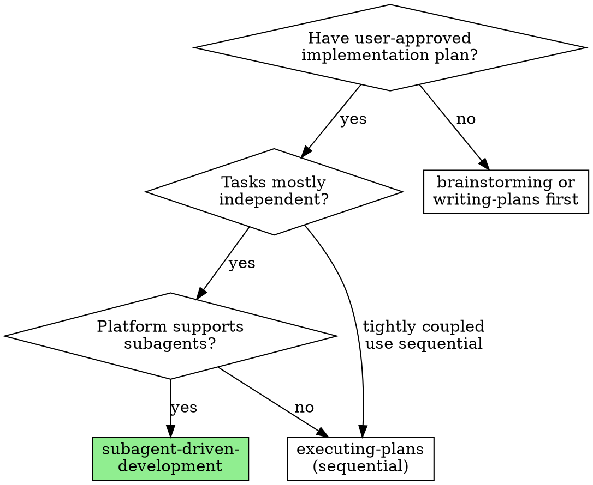
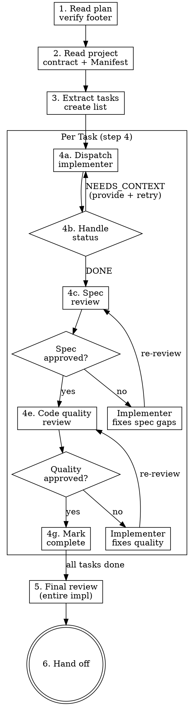

# Subagent-Driven Development

## Overview

Execute a plan by dispatching a fresh subagent per task, with two-stage review after each: spec compliance first, then code quality. Fresh context per task eliminates context pollution. Two-stage review catches both "did you build the right thing?" and "did you build it well?" L07's argument: agents overreach — subagent isolation prevents one task's complexity from bleeding into the next. L09's argument: agents declare victory too early — two independent reviewers make premature victory claims harder.

## Iron Law

**NO TASK SHIPS WITHOUT BOTH SPEC-COMPLIANCE AND CODE-QUALITY REVIEW PASSING.**

**SPEC COMPLIANCE REVIEW MUST PASS BEFORE CODE-QUALITY REVIEW STARTS.**

The plan must contain the footer signature `**User-approved:** <timestamp> by <user>`. Without it, refuse to run.

## When to use

## Process flow

1. **Read plan file.** Verify `**User-approved:**` footer exists. Refuse without it. Then verify the plan references a brainstorming spec (Section 1 or header). If the spec file is missing or incomplete (lacks all 6 sections), refuse: "Plan references spec at `<path>`, but spec is missing or incomplete. Run `zeus:brainstorming` first."
2. **Read the project contract** per `references/project-contract.md` — extract DoD, Commands, Conventions (file-size thresholds), Invariants. **Read Logic Completeness Manifest** (plan Section 9).
3. **Extract all tasks** with full text from plan Section 4. Create task list. Note inter-task dependencies and context each task needs.
4. **Per-task execution:**
   a. Dispatch **implementer subagent** (`./implementer-prompt.md`) with full task text + scene-setting context. Do not make the subagent read the plan file — provide everything inline.
   b. Handle implementer status (see § Handling implemenr status below).
   c. Dispatch **spec-reviewer subagent** (`./spec-reviewer-prompt.md`). Reviewer verifies: all requirements met, nothing extra, no unauthorized simplification vs Manifest.
   d. If spec review fails → implementer fixes → spec re-review. Loop until approved.
   e. Dispatch **code-quality-reviewer subagent** (`./code-quality-reviewer-prompt.md`). Reviewer checks: clean code, tests, file-size conventions, ecosystem-standard tooling, no anti-patterns.
   f. If quality review fails → implementer fixes → quality re-review. Loop until approved.
   g. Mark task complete.
5. **Final review.** Dispatch a code reviewer for the entire implementation across all tasks.
6. **Hand off** to `zeus:finishing-a-development-branch` (SP7 forward ref; until then, present merge options inline).

## Model selection guidance

Use the least powerful model that can handle each role to conserve cost and increase speed.

| Task complexity signal | Recommended model tier |
|----------------------|----------------------|
| Touches 1-2 files with complete spec | Fast / cheap model |
| Touches multiple files with integration concerns | Stal |
| Requires design judgment or broad codebase understanding | Most capable model |
| Spec compliance review | Standard model |
| Code quality review | Standard model |
| Final cross-task review | Most capable model |

## Handling implementer status

Implementer subagents report one of four statuses:

**DONE** — Proceed to spec compliance review.

**DONE_WITH_CONCERNS** — Read the concerns before proceeding. If concerns are about correctness or scope, address them before review. If they're observations (e.g., "this file is getting large"), note them and proceed.

**NEEDS_CONTEXT** — Provide the missing context and re-dispatch. Do not guess what the subagent needs — read their specific request.

**BLOCKED** — Assess the blocker:
1. Context problem → provide more context, re-dispatch same model.
2. Task requires more reasoning → re-dispatch with a more capable model.
3. Task is too large → break into smaller pieces.
4. Plan itself is wrong → escalate to the user.

Never ignore an escalation or force the same model to retry without changes.

## Anti-rationalization table

| Thought | Reality |
|---------|---------|
| "I'll skip spec review, the implementer self-reviewed." | Self-review aindependent review catch different things. Both are required. |
| "Quality review found only minor issues, ship it." | Minor issues compound. Fix them. The review loop is cheap. |
| "I'll dispatch multiple implementers in parallel for speed." | Parallel implementers on shared files cause conflicts. One at a time. |
| "Subagent asked a question but I know the answer is obvious." | Answer clearly and completely. What's obvious to you may not be to a fresh context. |
| "I'll let the implementer read the plan file directly." | Subagents work best with full text provided inline. File reading wastes their context on navigation. |
| "Spec review passed, I'll skip quality review this once." | Both reviews are required. Spec compliance and code quality are different concerns. |
| "The implementer said BLOCKED but I think they can figure it out." | If they said BLOCKED, something needs to change. Don't force retry without changes. |

## Red flags / Stop conditions

- Plan has no `**User-approved:**` footer → refuse to execute.
- Plan references no brainstorming spec, or spec file is missing → refuse to execute, redirect to `zeus:brainstorming`.
- Implementer reports BLOCKED and no resolution path is clear → escalate to user.
- Spec reviewer finds unauthorized simplification vs Manifest → implementer must fix before quality review.
- Code quality reviewer flags custom validation scripts instead of ecosystem-standard tools → Critical issue, must fix.
- Agent starts code-quality review before spec compliance is approved → wrong order, stop.
- Agent dispatches multiple implementers in parallel on tasks that share files → stop, serialize.
- Review loop exceeds 3 iterations for the same issue → escalate to user.

## Verification checklist

- [ ] Plan footer signature verified before first task.
- [ ] Project contract (per `references/project-contract.md`) and Logic Completeness Manifest read.
- [ ] All tasks extracted with full text (subagents never read plan file directly).
- [ ] Every task went through: implementer → spec review (approved) → quality review (approved).
- [ ] Spec review always completed before quality review started.
- [ ] All implementer escalations (NEEDS_CONTEXT, BLOCKED) were handled.
- [ ] No unauthorized simplification shipped (Manifest check in spec review).
- [ ] Final cross-task review completed.
- [ ] Hand off to finishing-a-development-branch (or inline merge options).

## Integration

- **Predecessor:** `zeus:writing-plans` (plan must exist with approval footer).
- **Successor:** `zeus:finishing-a-development-branch` (SP7 forward ref).
- **Prompt templates:** `./implementer-prompt.md`, `./spec-reviewer-prompt.md`, `./code-quality-reviewer-prompt.md`.
- **Subagents use:** `zeus:test-driven-development` (via implementer prompt).
- **Alternative:** `zeus:executing-plans` (when subagents not available).
- **Gates addressed:** G2 (via implementer TDD), G3 (fresh verification per task), G4 (DoD enforcement).
- **Defends layer:** 3 (execution environment).
