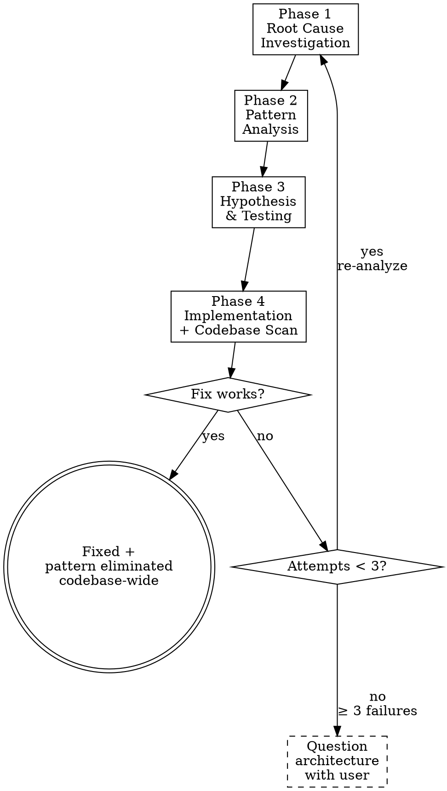

# Systematic Debugging

## Overview

Random fixes waste time and create new bugs. Quick patches mask underlying issues. L09's argument: agents declare victory based on internal reasoning — in debugging, this manifests as "I think the fix is X" without understanding why X broke. Systematic debugging forces the agent through four phases: investigate the root cause, analyze the pattern, form and test a hypothesis, then implement a complete fix grounded in best practices. After 3 failed fixes, question the architecture — don't attempt fix #4.

## Iron Law

**NO FIXES WITHOUT ROOT CAUSE INVESTIGATION FIRST.**

If you haven't completed Phase 1, you cannot propose fixes. "I think it's X" is not investigation — it's guessing.

## Process flow

### Phase 1 — Root Cause Investigation

Before attempting ANY fix:

1. **Read error messages carefully.** Don't skip past errors or warnings. They often contain the exact solution. Read stack traces completely. Note line numbers, file paths, error codes.

2. **Reproduce consistently.** Can you trigger it reliably? What are the exact steps? If not reproducible → gather more data, don't guess.

3. **Check recent changes.** `git diff`, recent commits, new dependencies, config changes, environmental differences.

4. **Gather evidence in multi-component systems.** For each component boundary: log what enters, log what exits, verify environment propagation, check state at each layer. Run once to gather evidence showing WHERE it breaks. Then investigate that specific component.

5. **Trace data flow.** Where does the bad value originate? What called this with the bad value? Keep tracing up until you find the source. See `./root-cause-tracing.md` for the complete backward tracing technique.

### Phase 2 — Pattern Analysis

6. **Find working examples.** Locate similar working de in the same codebase. What works that's similar to what's broken?

7. **Compare against references.** If implementing a pattern, read the reference implementation COMPLETELY. Don't skim — read every line.

8. **Identify differences.** What's different between working and broken? List every difference, however small. Don't assume "that can't matter."

9. **Understand dependencies.** What other components does this need? What settings, config, environment? What assumptions does it make?

### Phase 3 — Hypothesis and Testing

10. **Form single hypothesis.** State clearly: "I think X is the root cause because Y." Be specific, not vague.

11. **Test minimally.** Make the SMALLEST possible change to test the hypothesis. One variable at a time. Don't fix multiple things at once.

12. **Verify before continuing.** Did it work? Yes → Phase 4. No → form NEW hypothesis. Don't add more fixes on top.

### Phase 4 — Implementation

13. **Create failing test case.** Use `zeus:test-driven-development` — write a test that reproduces the bug, watch it fail. This test proves the fix and prevents regression.

14. **Implement single fix.** Address the root cause identified. ONE ge at a time. No "while I'm here" improvements. No bundled refactoring.

15. **Verify fix.** Test passes? No other tests broken? Issue actually resolved? Use `zeus:verification-before-completion` — evidence, not assumptions.

16. **Codebase-wide pattern scan (Senior-architect fix discipline).** After fixing the root cause:
    - Search the entire codebase for the same anti-pattern: `grep -rn '<pattern>' src/`
    - Count occurrences.
    - Ask the user: **"This pattern appears in N other places. Want me to scan the full codebase and fix all instances at once?"**
    - If user approves, fix all instances using the same best-practice solution.
    - Add defense-in-depth validation at multiple layers (see `./defense-in-depth.md`).

17. **Best-practice research.** Before implementing the fix, identify the ecosystem's established best practice for this class of problem. Use it — don't invent a novel approach when a proven pattern exists. Examples:
    - Race condition → use the language's standard concurrency primitives, not custom locks.
    - SQL injection → use parameterized queries, not manual escaping.
    - Flaky timeout → use condition-based waiting (see `./condition-based-waiting.md`), not longer sleeps.

### 3-failure architectural escalation

18. **If fix doesn't work after 3 attempts → STOP.**
    - Count: how many fixes have you tried?
    - If < 3: return to Phase 1, re-analyze with new information.
    - If ≥ 3: STOP and question the architecture.

    Pattern indicating architectural problem:
    - Each fix reveals new shared state / coupling / problem in a different place.
    - Fixes require "massive refactoring" to implement.
    - Each fix creates new symptoms elsewhere.

    **Discuss with the user before attempting more fixes.** This is not a failed hypothesis — this is a wrong architecture.

## Senior-architect fix discipline

**A fix is not just a patch — it's a complete solution grounded in best practices.**

1. **Root-cause, not symptom.** Never patch the immediate error. Trace to the source.
2. **Best-practice research.** Identify the ecosystem's established solution before implementing.
3. **Complete code logic.** Proper error handling, edge cases, type safety, validation at boundaries.
4. **Big-picture scan.** After fixing one instance, search for the same pattern everywhere. Ask user before scanning.
5. **Defense-in-depth.** Add validation at every layer data passes through (see `./defense-in-depth.md`). Make the bug structurally impossible, not just fixed in one place.
6. **Proactive communication.** Surface related risks: "While fixing X, I noticed Y uses the same anti-pattern. Recommend fixing both."

## Anti-rationalization table

| Thought | Reality |
|---------|---------|
| "Issue is simple, don't need process." | Simple issues have root causes too. Process is fast for simple bugs. |
| "Emergency, no time for process." | Systematic debugging is FASTER than guess-and-check thrashing. |
| "Just try this first, then investigate." | First fix sets the pattern. Do it right from the start. |
| "I see the problem, let me fix it." | Seeing symptoms is not understanding root cause. Investigate first. |
| "One more fix attempt" (after 2+ failures) | 3+ failures = architectural problem. Question the pattern, don't fix again. |
| "I'll fix just this one instance." | Same anti-pattern likely exists elsewhere. Scan the codebase. Ask the user. |
| "Quick patch now, proper fix later." | "Later" never comes. Fix it properly now with bctices. |
| "I'll increase the timeout." | Investigate why it's slow. Use condition-based waiting, not longer sleeps. |
| "Reference too long, I'll adapt the pattern." | Partial understanding guarantees bugs. Read it completely. |

## Red flags / Stop conditions

- Proposing fixes before completing Phase 1 → stop, investigate first.
- "Just try changing X and see if it works" → stop, that's guessing.
- Adding multiple changes at once → stop, one variable at a time.
- Fix #3 failed → stop, question the architecture with the user.
- Each fix reveals problems in different places → architectural issue, not a bug.
- Agent fixes one instance without scanning for the same pattern → stop, scan the codebase.
- Agent uses a custom workaround instead of the ecosystem's standard solution → stop, research best practices.

## Verification checklist

- [ ] Phase 1 completed: root cause identified with evidence.
- [ ] Phase 2 completed: working examples found, differences identified.
- [ ] Phase 3 completed: hypothesis formed, tested minimally.
- [ ] Failing test case created before fix (TDD).
- [ ] Single fix implemented addressing root cause.
- [ ] Fix verified with evidence (test passes, no regressions).
- [ ] Codebase scanner same anti-pattern. User asked about batch fix.
- [ ] Best-practice solution used (not a novel workaround).
- [ ] Defense-in-depth validation added where appropriate.
- [ ] No more than 3 fix attempts without architectural discussion.

## Supporting references

These reference docs are part of systematic debugging and live in this directory:

- **`./root-cause-tracing.md`** — Trace bugs backward through the call stack to find the original trigger.
- **`./defense-in-depth.md`** — Add validation at multiple layers after finding root cause. Make the bug structurally impossible.
- **`./condition-based-waiting.md`** — Replace arbitrary timeouts with condition polling. Fix flaky tests properly.

## Integration

- **Called from:** `zeus:test-driven-development` (G2 failure after 3 red-green attempts).
- **Calls:** `zeus:test-driven-development` (Phase 4, step 13 — create failing test case).
- **Calls:** `zeus:verification-before-completion` (Phase 4, step 15 — verify fix with evidence).
- **Escalates to:** user (3-failure architectural escalation).
- **Gates addressed:** G2 — unblocks TDD when tests can't go green.
- **Defends layer:** 4 (verification feedback).
