# Test-Driven Development

## Overview

L09's argument: agents declare victory based on internal reasoning rather than objective evidence. L10's argument: until the whole pipeline runs, unit-level passes mean nothing in the integrated context. TDD addresses both by forcing the agent to watch a test fail before writing code, then watch it pass after — producing the two-run evidence that G2 requires. The red-green flip is the proof. A test that only ever showed PASS proves nothing.

## Iron Law

**NO PRODUCTION CODE WITHOUT A FAILING TEST FIRST.**

Wrote code before the test? Delete it. Start over.

- Do not keep it as "reference."
- Do not "adapt" it while writing tests.
- Do not look at it.
- Delete means delete.

Implement fresh from tests. Period.

## Process flow

1. **RED** — Write one minimal failing test showing what should happen. One behavior per test. Clear name describing the behavior.
2. **Run test** — Execute the project's real test runner (from AGENTS.md `## Commands`). Capture full terminal output showing FAIL.
3. **Verify RED** — Confirm: test fails (not errors), failure message is expected, fails because the feature is missing (not typos or import errors). If the test passes immediately, the test is wrong — fix it.
4. **GREEN** — Write the simplest code that makes the test pass. Nothing more.
5. **Run test** — Execute the same test runner. Capture full terminal output showing PASS.
6. **Verify GREEN** — Confirm: test passes, all other tests still pass, output is clean (no warnings, no errors).
7. **REFACTOR** — Clean up. Remove duplication, improve names, extract helpers. Keep tests green throughout.
8. **Repeat** — Next failing test for the next behavior.

```dot
digraph tdd_cycle {
  rankdir=LR;
  red [label="1. RED\nWrite failing test", shape=box, style=filled, fillcolor="#ffcccc"];
  run_red [label="2-3. Run + Verify\nFAIL output", shape=diamond];
  green [label="4. GREEN\nMinimal code", shape=box, style=filled, fillcolor="#ccffcc"];
  run_green [label="5-6. Run + Verify\nPASS output", shape=diamond];
  refactor [label="7. REFACTOR\nClean up", shape=box, style=filled, fillcolor="#ccccff"];
  next [label="8. Next behavior", shape=ellipse];

  red -> run_red;
  run_red -> green [label="fails correctly"];
  run_red -> red [label="wrong failure\nor passes"];
  green -> run_green;
  run_green -> refactor [label="passes"];
  run_green -> green [label="still fails"];
  refactor -> run_green [label="verify still green"];
  run_green -> next [label="all green"];
  next -> red;
}
```

### G2 evidence contract

Both terminal outputs — the FAIL run and the PASS run — must be captured verbatim in context. Not paraphrased. Not summarized. Not "I think it's working." Actual stdout pasted back. This is the evidence G2 reads. Without both runs in context, G2 stays closed.

### Failure routing

If green never arrives after 3 red-green attempts on the same test:

1. Route to `zeus:systematic-debugging` (SP5) for 4-phase root-cause analysis.
2. If systematic-debugging is not yet available (pre-SP5), escalate to the user with: "3 attempts failed. Here's what I tried and what I observed. How should we proceed?"

## Ecosystem-standard tooling mandate

Use the project's real test runner and real lint/format tools — never hand-rolled scripts.

**If the ecosystem has a standard tool for the job, use it. If you don't know the tool, look it up — don't reinvent it.**

### Per-stack standard tooling floor

| Stack | Test runner | Lint / Static analysis | Format |
|-------|------------|----------------------|--------|
| JavaScript / TypeScript | Jest / Vitest / Mocha | ESLint | Prettier |
| Python | pytest | Ruff / Pylint / Flake8 | Black / Ruff format |
| Rust | cargo test | cargo clippy | cargo fmt |
| Go | go test | golangci-lint | gofmt / goimports |
| Java / Kotlin | JUnit / TestNG | Checkstyle / SpotBugs / ktlint | google-java-format / ktfmt |
| Ruby | RSpec / Minitest | RuboCop | RuboCop --auto-correct |
| PHP | PHPUnit | PHPStan / Psalm | PHP-CS-Fixer |
| Swift | XCTest | SwiftLint | swift-format |
| C / C++ | GoogleTest / Catch2 | clang-tidy / cppcheck | clang-format |

For stacks not in the table, identify the ecosystem's standard tools before writing any tests.

### Anti-pattern examples

| Bad (custom script) | Good (ecosystem tool) |
|---------------------|----------------------|
| `grep -r 'console.log' src/` to check for debug statements | `eslint --rule 'no-console: error' src/` |
| `python -c "import ast; ast.parse(open('x.py').read())"` to check syntax | `ruff check x.py` + `mypy --strict x.py` |
| `find . -name '*.rs' -exec grep 'unwrap()' {} \;` to find panics | `cargo clippy -- -D clippy::unwrap_used` |
| `node -e "require('./dist/index.js')"` to verify build | `vitest --run` or `npm test` |
| Hand-written shell script to check for known CVEs | `npm audit` / `pip-audit` / `cargo audit` |

## Good tests

| Quality | Good | Bad |
|---------|------|-----|
| Minimal | One behavior. "and" in the name? Split it. | `test('validates email and domain and whitespace')` |
| Clear | Name describes behavior | `test('t1')` |
| Shows intent | Demonstrates desired API | Obscures what code should do |
| Real code | Tests real behavior | Tests mock behavior |

## Anti-rationalization table

| Thought | Reality |
|---------|---------|
| "Too simple to test" | Simple code breaks. Test takes 30 seconds. |
| "I'll test after" | Tests passing immediately prove nothing. |
| "Tests after achieve same goals" | Tests-after = "what does this do?" Tests-first = "what should this do?" Different questions, different coverage. |
| "Already manually tested" | Ad-hoc is not systematic. No record, can't re-run, can't catch regressions. |
| "Deleting X hours of work is wasteful" | Sunk cost fallacy. Keeping unverified code is technical debt with compound interest. |
| "Keep as reference, write tests first" | You'll adapt it. That's testing after with extra steps. Delete means delete. |
| "Need to explore first" | Fine. Throw away exploration code, then start with TDD. |
| "Test is hard to write = skip TDD" | Hard to test = hard to use. Listen to the test — simplify the interface. |
| "TDD will slow me down" | TDD is faster than debugging. The slowdown is an illusion from front-loading the thinking. |
| "Manual test is faster" | Manual doeprove edge cases. You'll re-test every change manually forever. |
| "Existing code has no tests" | You're improving it. Add tests for the code you touch. |
| "I'll write a quick check script instead of configuring ESLint" | If the ecosystem has a standard tool, use it. Custom scripts produce false confidence — they're always weaker than battle-tested tools. |
| "This is different because..." | It's not. All of these mean: delete code, start over with TDD. |

## Red flags / Stop conditions

- Code written before test → delete code, start over.
- Test passes immediately on first run → test is wrong. Fix the test.
- Cplain why the test failed → do not proceed to GREEN. Understand the failure first.
- Test errors (import failure, syntax error) instead of failing → fix the error, re-run until it fails correctly.
- Agent rationalizing "just this once" → stop. Read the anti-rationalization table.
- 3 failed red-green attempts → route to systematic-debugging or escalate to user.
- Agent using a hand-rolled validation script instead of the ecosystem's standard tool → stop, switch to the real tool.

## Verification checklist

- [ ] Every new function/method has a test.
- [ ] Watched each test fail before implementing (FAIL output in context).
- [ ] Each test failed for the expected reason (feature missing, not typo).
- [ ] Wrote minimal code to pass each test.
- [ ] All tests pass (PASS output in context).
- [ ] Output is clean (no errors, no warnings).
- [ ] Tests use real code (mocks only when unavoidable — external APIs, time, randomness).
- [ ] Edge cases and error paths covered.
- [ ] Used the project's real test runner from AGENTS.md, not a custom script.

## Integration

- **Called by:** `zeus:executing-plans` (per task), `zeus:subagent-driven-development` (via implementer subagents).
- **Failure routes to:** `zeus:systematic-debugging` (SP5 forfter 3 failed attempts.
- **Gates addressed:** G2 — produces the two-run evidence (FAIL then PASS).
- **Defends layer:** 4 (verification feedback).
