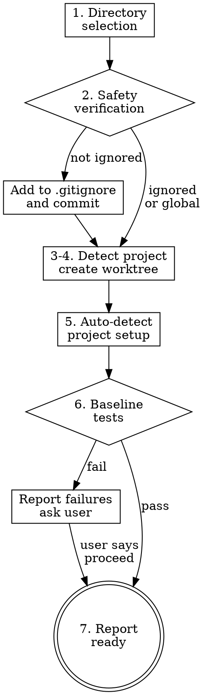

# Using Git Worktrees

## Overview

L06's argument: initialization needs its own phase — jumping straight into code without setting up a clean workspace leads to contaminated state, broken baselines, and wasted debugging time. Git worktrees create isolated workspaces sharing the same repository, allowing work on multiple branches simultaneously without switching. This skill systematizes the setup: smart directory selection, safety verification, dependency installation, and baseline test — so the agent starts from a known-good state every time.

## Process flow

1. **Directory selection.** Follow this priority order:
   a. Check existing directories: `ls -d .worktrees 2>/dev/null` then `ls -d worktrees 2>/dev/null`. If both exist, `.worktrees` wins.
   b. Check the project contract (`CLAUDE.md` or `AGENTS.md` per `references/project-contract.md`) for a worktree directory preference: `grep -i 'worktree.*director' CLAUDE.md AGENTS.md 2>/dev/null`. If found, use it.
   c. Ask the user:
   ```
   No worktree directory found. Where should I create worktrees?

   1. .worktrees/ (project-local, hidden)
   2. ~/.config/zeus/worktrees/<project-name>/ (global location)

   Which do you prefer?
   ```

2. **Safety verification** (project-local directories only).
   ```bash
   git check-ignore -q .worktrees 2>/dev/null
   ```
   If the directory is NOT ignored by gitignore, fix immediately:
   - Add the directory to `.gitignore`
   - Commit the change: `git add .gitignore && git commit -m "chore: add worktree directory to .gitignore"`
   - Then proceed with worktree creation.

   Global directories (`~/.config/zeus/worktrees/`) skip this check — they're outside the repo.

3. **Detect project name.**
   ```bash
   project=$(basename "$(git rev-parse --show-toplevel)")
   ```

4. **Create worktree.**
   ```bash
   git worktree add "<path>/<branch-name>" -b "<branch-name>"
   cd "<path>/<branch-name>"
   ```

5. **Auto-detect and run project setup.** Check for project files and run the appropriate install command:

   | Marker file | Setup command |
   |------------|---------------|
   | `package.json` + `package-lock.json` | `npm install` |
   | `package.json` + `yarn.lock` | `yarn install` |
   | `package.json` + `pnpm-lock.yaml` | `pnpm install` |
   | `Cargo.toml` | `cargo build` |
   | `requirements.txt` | `pip install -r requirements.txt` |
   | `pyproject.toml` + `poetry.lock` | `poetry install` |
   | `pyproject.toml` (no poetry) | `pip install -e .` |
   | `go.mod` | `go mod download` |
   | `Gemfile` | `bundle install` |
   | `composer.json` | `composer install` |

   If no marker file is found, skip dependency installation.

6. **Run baseline tests.** Read the project contract's `## Commands` (per `references/project-contract.md`) for the project's test command. Run it using the project's real test runner — never a hand-rolled smoke script.
   ```bash
   # Use whatever the project contract specifies, e.g.:
   npm test          # Node.js
   cargo test        # Rust
   pytest            # Python
   go test ./...     # Go
   ```
   - If tests **pass**: report ready.
   - If tests **fail**: report failures and ask whether to proceed or investigate. Do not silently proceed with a broken baseline.

7. **Report.**
   ```
   Worktree ready at <full-path>
   Branch: <branch-name>
   Tests: <N> passing, <M> failing (or "all passing")
   Ready to implement <feature-name>
   ```



## Quick reference

| Situation | Action |
|-----------|--------|
| `.worktrees/` exists | Use it (verify ignored) |
| `worktrees/` exists | Use it (verify ignored) |
| Both exist | Use `.worktrees/` |
| Neither exists | Check project contract (CLAUDE.md / AGENTS.md) → ask user |
| Directory not ignored | Add to .gitignore, commit, proceed |
| Tests fail during baseline | Report failures, ask user |
| No package.json / Cargo.toml / etc. | Skip dependency install |
| Project contract has no test command | Ask user for the test command |

## Anti-rationalization table

| Thought | Reality |
|---------|---------|
| "I'll skip the ignore check, it's probably fine." | Worktree contents accidentally tracked polluttatus and can end up committed. Always check. |
| "I'll skip baseline tests, they'll pass." | If they don't pass, you can't distinguish new bugs from pre-existing ones. Always run. |
| "I'll just run `node index.js` to verify the setup." | Use the project's real test runner from the project contract. A quick smoke test is not a baseline. |
| "I know the directory convention, no need to check." | Projects evolve. Follow the priority chain every time. |
| "Tests are slow, I'll skip them to save time." | A broken baseline costs more time than a slow test run. Run them. |
| "I'll create the worktree on main instead of a feature branch." | Worktrees are for isolation. a feature branch. |

## Red flags / Stop conditions

- Creating a project-local worktree without verifying it's gitignored → stop, verify first.
- Skipping baseline test verification → stop, run tests.
- Proceeding with failing baseline tests without user permission → stop, report and ask.
- Assuming directory location when ambiguous → stop, follow the priority chain.
- Using a hand-rolled smoke script instead of the project's real test runner → stop, use the real tool.

## Verification checklist

- [ ] Directory selected following priority chain (existing > project contract > ask user).
- [ ] Project-local directory verified as gitignored (or fixed and committed).
- [ ] Worktree created on a feature branch (not main/master).
- [ ] Project setup auto-detected and run (or skipped if no marker file).
- [ ] Baseline tests run using the project's real test runner from the project contract (per `references/project-contract.md`).
- [ ] Test results reported to user (pass count, fail count).
- [ ] Worktree location reported with full path.

## Integration

- **Called by:** `zeus:executing-plans` and `zeus:subagent-driven-development` before first task execution. Also callable directly when the user wants workspace isolation.
- **Pairs with:** `zeus:finishing-a-elopment-branch` (SP7) for cleanup after work is complete.
- **Gates addressed:** none directly — this is setup, not verification.
- **Defends layer:** 3 (execution environment).
