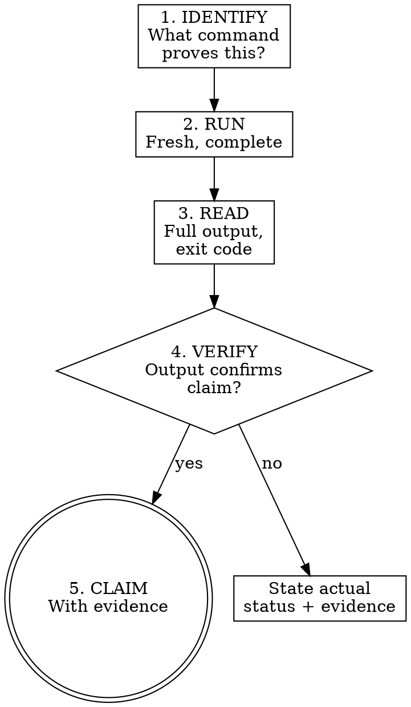

# Verification Before Completion

## Overview

L09's argument: agents declare victory based on internal reasoning rather than objective evidence. They write code, read their own output, think "looks good," and stop. The Verification Gap is the distance between "I think it works" and "I ran the command and here's the output." This skill closes that gap by forcing the agent to run the actual command, read the actual output, and only then make the claim. No shortcuts. No paraphrasing. No "should work now."

## Iron Law

**NO COMPLETION CLAIMS WITHOUT FRESH VERIFICATION EVIDENCE.**

If you haven't run the verification command in this message, you cannot claim it passes. "Fresh" means this turn, not a previous run. "Evidence" means actual stdout, not a summary.

## Process flow

1. **IDENTIFY** — What command proves this claim? Every claim maps to a specific command. "Tests pass" → the test runner. "Build succeeds" → the build command. "Lint clean" → the linter. Use the project's real ecosystem tools from the project contract's `## Commands` (read per `references/project-contract.md`) — never a custom script.

2. **RUN** — Execute the full command. Fresh. Complete. Not a partial run, not a cached result, not "I ran it earlier."

3. **READ** — Read the full output. Check exit code. Count failures, warnings, errors. Do not skim. Do not summarize prematurely.

4. **VERIFY** — Does the output confirm the claim?
   - If NO → state actual status with evidence. Do not spin. "3 tests failing" not "almost passing."
   - If YES → proceed to step 5.

5. **CLAIM** — State the claim WITH the evidence. "All 47 tests pass (output above)" not "tests pass."

## Common failures

| Claim | Requires | Not sufficient |
|-------|----------|----------------|
| "Tests pass" | Test command output: 0 failures | Previous run, "should pass," internal reasoning |
| "Linter clean" | Linter output: 0 errors | Partial check, extrapolation from subset |
| "Build succeeds" | Build command: exit 0 | Linter passing, "logs look good" |
| "Bug fixed" | Test original symptom: passes | "Code changed, assumed fixed" |
| "Regression test works" | Red-green cycle verified | Test passes once (never saw it fail) |
| "Requirements met" | Line-by-line checklist with evidence | "Tests passing" (tests may not cover all requirements) |
| "All spec features done" | Every `SC-N` in the spec's Scope Checklist mapped to fresh passing evidence (`check-spec-coverage.sh` exit 0, plus a green verification per `SC-N`) | "Tests pass" — a feature can be unlisted or unimplemented while every existing test stays green |
| "Agent completed" | VCS diff shows changes + verification | Agent reports "success" (agents lie) |

## Ecosystem-standard tooling mandate

Verification commands must use the ecosystem's real tools:

| Claim | Not this |
|-------|----------|----------|
| "No lint errors" | `eslint src/` / `ruff check .` / `cargo clippy` | `grep -r 'console.log'` |
| "Tests pass" | `pytest` / `vitest --run` / `cargo test` | `node -e "require('./index')"` |
| "Build clean" | `npm run build` / `cargo build` / `go build ./...` | "It imported without errors" |
| "No vulnerabilities" | `npm audit` / `pip-audit` / `cargo audit` | Hand-written CVE check script |
| "Types correct" | `mypy --strict` / `tsc --noEmit` | "No red squiggles in editor" |

## Anti-rationalization table

| Thought | Reality |
|---------|------ould work now" | RUN the verification. "Should" is not evidence. |
| "I'm confident" | Confidence is not evidence. Run the command. |
| "Just this once" | No exceptions. The one time you skip is the time it's broken. |
| "Linter passed so build will too" | Linter and compiler check different things. Run both. |
| "Agent said success" | Agents lie. Verify independently. |
| "I'm tired and want to finish" | Exhaustion is not an excuse. Run the command. |
| "Partial check is enough" | Partial proves nothing about the unchecked part. |
| "Different words so rule doesn't apply" | Spirit over letter. Any claim of success requires evidence. |
| "I ran it last turn" | "Fresh" means this turn. State changes between turns. |

## Red flags / Stop conditions

- Using "should," "probably," "seems to," "looks like" before running verification → stop, run the command.
- Expressing satisfaction before verification ("Great!", "Perfect!", "Done!") → stop, run the command.
- About to commit/push/PR without verification → stop, run the command.
- Trusting agent success reports without independent verification → stop, verify yourself.
- Relying on partial verification ("lint passed so it's fine") → stop, run the full check.
- Thinking "just this once" → stop. Read the Iron Law again.
- Using a custom script instead of the ecosystem's standard tool → stop, use the real tool.

## Verification checklist

- [ ] Identified the specific command that proves the claim.
- [ ] Ran the command fresh (this turn, not cached).
- [ ] Read the full output (not skimmed, not summarized).
- [ ] Exit code checked.
- [ ] Output confirms the claim (or actual status stated with evidence).
- [ ] Used ecosystem-standard tool, not a custom script.
- [ ] Claim stated WITH evidence reference.

## Integration

- **Called by:** `zeus:executing-plans` (per-task verification, G3), `zeus:subagent-driven-development` (per-task), `zs:e2e-gate` (DoD sweep).
- **Gates addressed:** G3 — the dedicated gatekeeper for fresh verification.
- **Defends layer:** 4 (verification feedback).
