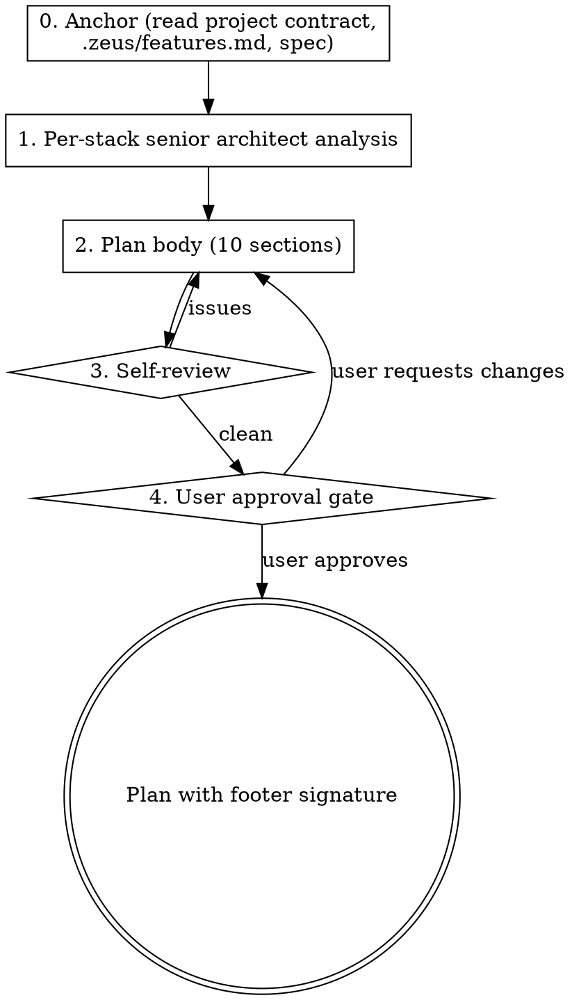

# Writing Plans

## Overview

Writing-plans turns an approved brainstorming spec into a concrete, bite-sized, command-verifiable implementation plan. It re-reads the spec word-by-word from senior-architect lenses for every active tech stack, surfaces risks the spec didn't catch, and produces a 10-section plan that bakes test coverage, security scans, multi-stack logic review, and anti-simplification guarantees directly into the document. Execution is hard-gated by a footer signature so no task runs until the user explicitly approves.

## Phase banner (print first)

Before any other action in this skill, your **first user-facing output** MUST be the phase banner below, matched to the user's conversation language. Use ZH verbatim for Chinese, EN verbatim for English; for any other language, translate the EN template preserving the structure (header line, Goal, Not yet, Output). Print it as a fenced code block so the separators render cleanly.

**EN:**
```
━━━ Phase 2/3 · Design ━━━
Goal: turn approved spec into executable steps — File Map, tasks, TDD, verify commands
Not yet: code (just the route map)
Output: plan → your approval → Phase 3 (Execution)
```

**ZH:**
```
━━━ 阶段 2/3 · 设计 ━━━
目标:把已批准方案拆成可执行步骤 — File Map、任务清单、TDD 步骤、验证命令
此阶段不做:写代码(只画路线图)
产出:plan 文档 → 你批准 → 进入阶段 3(执行)
```

## Iron Law

**NO PLAN SHIPS WITHOUT:**

1. **Per-stack senior-architect requirements analysis** (one lens per active tech stack in the project contract).
2. **Per-task TDD steps with concrete commands.**
3. **Comprehensive test plan** (unit + integration + E2E + regression).
4. **Security review** (specific tools + threat model + named checks).
5. **Logic review checkpoints** (multi-stack).
6. **Logic Completeness Manifest.**
7. **File Size Constraints** (per-file projection vs project-contract thresholds).
8. **User explicit approval** (footer signature with timestamp).

**NO LOGIC SIMPLIFICATION WITHOUT EXPLICIT USER AUTHORIZATION RECORDED IN THE MANIFEST WITH 4 FIELDS (what / why / who / restoration).**

**NO TODO / STUB / MOCK-AS-FINAL IN PLAN STEPS UNLESS THE MANIFEST LOGS IT AS AUTHORIZED SIMPLIFICATION.**

`executing-plans` skills MUST verify the footer signature exists before running any task. No signature = no execution.

## Process flow

### Phase 0 — Anchor

1. Resolve the project contract per `references/project-contract.md` (CLAUDE.md → AGENTS.md). `cat` the selected file → extract DoD items, Commands, Conventions, Invariants, file-size thresholds.
2. `cat .zeus/features.md` → locate the F-NNN target.
3. `cat <spec>` (the spec being planned).
4. Missing any → refuse, redirect to corresponding `kickoff-*` or `zeus:brainstorming`.

### Phase 1 — Per-stack senior-architect requirements analysis

1. Enumerate active tech stacks from the project contract's `## Tech Stack`.
2. For each stack, switch the analysis lens to that stack's senior architect (use the multi-stack table below as the floor; extend at runtime as needed).
3. For each spec requirement:
   - **Restate**: "I read this as: <verbatim rephrasing>"
   - **Risk**: "Risk: <potential edge case / anti-pattern / coupling / complexity>"
   - **Question**: "Question: <unresolved ambiguity for the user>"
4. Combine outputs into the plan's "Architect Risk Analysis" section.
5. The user must confirm this section before Phase 2.

### Phase 2 — Plan main body construction (10 sections in this order)

1. **Header** — Goal / Architecture / Tech Stack / F-NNN tag / Spec link.
2. **File Map** — created vs modified, one-line responsibility per file.
3. **Architect Risk Analysis** (per-stack) — output of Phase 1.
4. **Tasks** — 2-5 minute granularity each, full TDD discipline:
   - Step 1: Write the failing test (full code).
   - Step 2: Run test to verify it fails (exact command, expected output).
   - Step 3: Write minimal implementation (full code).
   - Step 4: Run test to verify it passes.
   - Step 5: Commit (exact git command).
5. **Test Plan**
   - Unit tests: listed per file, target every new/modified function.
   - Integration tests: cross-component paths.
   - E2E tests: realistic user path.
   - Regression tests: existing-feature protection.
6. **Security Review**
   - Static scan tools by stack (semgrep / bandit / npm audit / cargo audit / trivy / etc.).
   - Threat model: new attack surface this introduces.
   - Specific checks: input validation / secrets / auth / injection / SSRF / path traversal.
7. **Logic Review Checkpoints**
   - Per-stack senior-architect checklist (data flow direction, error-handling layer, state ownership, race conditions, complexity threshold, module boundaries, YAGNI, 6-month maintainability).
   - Locations in the task sequence where these reviews must pause execution.
8. **G4 contract delta**
   - New DoD items to be appended to the project contract's `## Definition of Done` (or `.zeus/dod.md` if DoD is out-of-tree) after this plan completes.
9. **Logic Completeness Manifest**
   - Default body: "Every requirement in the linked spec MUST be implemented in full. Authorized simplifications: (none)"
   - **Spec Coverage Matrix** — an embedded `### Spec Coverage Matrix` (a subsection of this section, NOT a new top-level `##`, so the 10-section count is unchanged). A table mapping every spec `SC-N` to the task(s) that implement it and the command that proves it:

     | SC-ID | Capability | Implementing task(s) | Verification command |
     |---|---|---|---|

     Every `SC-N` from the spec's `### Scope Checklist` MUST appear here mapped to ≥1 task, OR be logged below as an authorized simplification. An unmapped `SC-N` is an orphan — the feature would ship missing.
   - If user authorizes simplification, 4-field block per item:
     - Simplification: <what>
     - Reason: <why user authorized>
     - Approved by: <user>
     - Approved at: <ISO timestamp>
     - Restoration ticket: <F-NNN or follow-up issue link>
10. **File Size Constraints**
    - Reads project contract → Conventions → File size conventions table.
    - For each file in the File Map (Section 2), project a line count.
    - Flag OK / (relaxed) / OVER per file.
    - Any OVER row must include a split plan or a Manifest exception link.

### Phase 3 — Self-review (zeus internal)

- All 10 sections present (`grep '^## ' <plan>` shows them).
- Every File Map row has a row in Section 10.
- Every Section 10 OVER row has a split plan or links to a Manifest entry.
- Every task has explicit verification command (no "run the tests").
- Test plan covers every new code path.
- Security section names specific tools + specific checks (no "do security checks").
- Multi-stack architect checklist answered for each active stack.
- No TBDs, TODOs, "appropriate", "similar to Task N" — full content everywhere.
- Logic Completeness Manifest present (even if "(none)").
- **Spec coverage gate (SC traceability):** every `SC-N` in the spec's `### Scope Checklist` is mapped to ≥1 task in the Spec Coverage Matrix, or logged as an authorized simplification. If `scripts/check-spec-coverage.sh` exists, run `bash scripts/check-spec-coverage.sh <spec> <plan>` and resolve any exit-1 orphan against the Manifest's authorized cuts; if the script does NOT exist, perform the check by hand and **explicitly declare** the degraded (manual) verification in the self-review output. A genuine orphan blocks the plan.

### Phase 4 — User approval gate (HARD GATE)

Print plan path and structured summary. Ask the user:

```
Plan ready at <path>. Review and approve before execution.
Reply 'approve' to unlock executing-plans, or list changes to fix first.
```

Block all `executing-plans` and `subagent-driven-development` invocations on the plan until the user replies `approve`.

On approval, append to plan footer:

```
**User-approved:** <ISO timestamp> by <user>
```

This footer line is the gate `executing-plans` reads — without it, refuse to run.



## Multi-stack lens (starter table — extend at runtime)

| Stack             | Senior architect must surface                                                                       |
| ----------------- | --------------------------------------------------------------------------------------------------- |
| Python            | Import boundary, async cancellation, type completeness (`mypy --strict`), packaging reproducibility, log boundaries |
| TypeScript / React | State granularity, render correctness, hook deps, error boundaries, Suspense placement, type narrowing exhaustiveness |
| Node / Express    | Event-loop blocking, stream backpressure, unhandled promises, middleware order, error bubbling      |
| Rust              | Ownership boundaries, async cancellation semantics, panic discipline, `Result`/`?`, `unsafe` necessity |
| Go                | Error wrapping, context propagation, goroutine leaks, channel close ownership, interface granularity |
| Postgres / SQL    | Migration locking, index plan, transaction isolation, rollback safety, N+1, `SERIALIZABLE` necessity |
| Redis / Kafka     | Persistence vs memory, at-least-once vs exactly-once, key TTL, partition / consumer-group balance   |
| Docker / K8s      | Image size, root user, healthcheck correctness, resource limits, ConfigMap vs Secret                |
| HTTP API          | Idempotency, contract version, error semantics, retry policy, timeout layering                      |
| Frontend build    | Bundle size, tree shaking, CSP, source-map exposure, cache busting                                  |

For stacks not in the table, generate the equivalent checklist at runtime: "what would a senior architect of this stack want to know?"

## File-size thresholds (default, sourced from the project contract when present)

| Scenario                       | Recommended    | Notes                                          |
| ------------------------------ | -------------- | ---------------------------------------------- |
| Utility / Helper               | 50–150 lines   | Pure functions, single responsibility          |
| Service / Controller (domain)  | 150–300 lines  | One class / module per domain concept          |
| Complex business logic         | 300–500 lines  | Acceptable; review for split                   |
| Config / Routing / Type defs   | (relaxed)      | High volume, low complexity                    |
| Test files                     | (relaxed)      | Long is OK; split by feature module when huge  |

## Anti-rationalization table

| Thought                                                                | Reality                                                                            |
| ---------------------------------------------------------------------- | ---------------------------------------------------------------------------------- |
| "Plan is too long with 10 sections, I'll merge them."                   | Each section addresses a distinct failure mode. Merging hides them again.            |
| "Spec is small, I can skip the multi-stack architect analysis."         | Even small specs touch ≥ 1 stack. The lens is per-stack-in-scope, not per-spec-size. |
| "Test plan duplicates the per-task TDD steps."                          | Per-task TDD covers one path. Test plan ensures the FULL feature has unit + integration + E2E + regression coverage. They complement, not duplicate. |
| "Security section: 'no new attack surface' is enough."                  | Even non-attack-surface code can leak secrets, log PII, or accept malformed input. Run the named scans. |
| "User said 'fast and simple', I'll skip the Manifest."                  | "Fast and simple" is not authorization to log simplifications anywhere except in the Manifest. Push back: "If you want to simplify, log it in the Manifest with the 4 fields." |
| "File Size table is overkill for this 2-task plan."                     | Two tasks creating two files still touch the convention. The table is 2 rows in that case. Cheap. |

## Red flags / Stop conditions

- Project contract (CLAUDE.md / AGENTS.md) / `.zeus/features.md` / spec missing → abort, redirect.
- User authorizes simplification verbally but refuses to log the 4 fields → refuse to ship plan; insist on the log.
- Multi-stack lens surfaces a risk the user dismisses without engagement → record the risk anyway in Architect Risk Analysis with note "user dismissed".
- Phase 3 self-review finds contradictions that won't resolve in two iterations → pause and ask user.

## Verification checklist (zeus internal — runs in Phase 3)

- All 10 sections present in the plan: `grep -c '^## \(Header\|File Map\|Architect Risk Analysis\|Tasks\|Test Plan\|Security Review\|Logic Review Checkpoints\|G4 contract delta\|Logic Completeness Manifest\|File Size Constraints\)' <plan>` ≥ 10.
- Every File Map file has a row in Section 10.
- Every OVER row has split plan or Manifest entry.
- No `TODO` / `XXX` / `mock` / `stub` patterns in plan task bodies (except as authorized in Manifest).
- Spec coverage: every `SC-N` in the spec's `### Scope Checklist` appears in the Spec Coverage Matrix mapped to a task — run `bash scripts/check-spec-coverage.sh <spec> <plan>` if present, else declare the manual/degraded check. Orphans resolved or logged as authorized cuts.

## Integration

- **Predecessor:** `zeus:brainstorming` (spec must exist) or `zeus:kickoff-feature-list` (.zeus/features.md must exist).
- **Successor:** SP4's `zeus:executing-plans` or `zeus:subagent-driven-development` (forward references; not yet landed).
- **References:** `references/karpathy-principles.md` — Simplicity First and Surgical Changes apply to every plan task this skill produces.
- **Gates addressed:** G4 (DoD delta + Logic Completeness Manifest are the contract execution-time gates enforce).
- **Defends layer:** 1 (task spec) and 4 (verification feedback).
